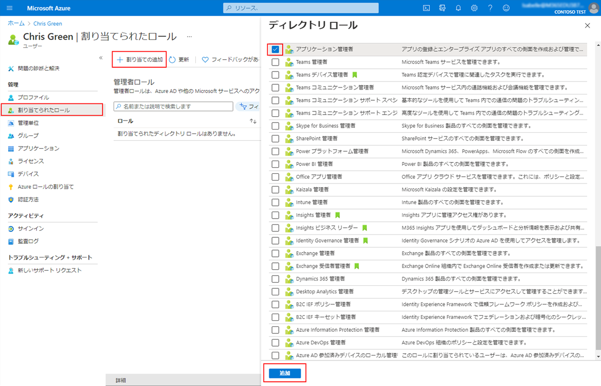
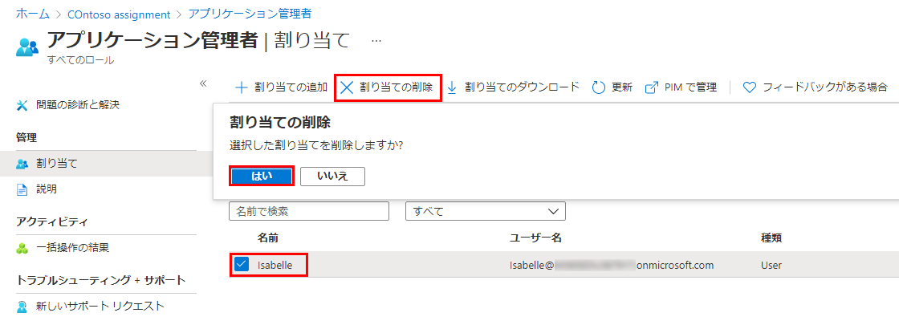

---
lab:
    title: '01 - ユーザー ロールを管理する'
    learning path: '01'
    module: 'モジュール 01 – ID 管理ソリューションを実装する'
---

# ラボ 01: ユーザー ロールを管理する

## ラボ シナリオ

あなたの会社では最近、アプリケーション管理者として業務を遂行する新しい従業員を採用しました。新しいユーザーを作成し、セキュリティ ロールを割り当てる必要があります。

#### 推定時間: 10 分

## 【割愛】Azure アカウントを作成し、Azure Active Directory Premium P2 試用版ライセンスを追加する

この演習のタスクとこのラーニング パスの演習では、使用できる Azure サブスクリプションを既に所有しているか、Azure 試用版アカウントにサインアップする必要があります。自分の Azure サブスクリプションを既に所有している場合は、このタスクをスキップし、次の手順に進むことができます。

1. Web ブラウザーで [https://azure.microsoft.com/free](https://azure.microsoft.com/free) にアクセスします。

1. ページを下にスクロールして、利用できる特典と無料サービスの詳細を確認します。

1. **「開始 (無料)」** を選択します。

1. ウィザードを使用して Azure 試用版サブスクリプションにサインアップします。

1. 一部の演習では、完了するために Azure AD P2 ライセンスが必要です。作成した組織で、**Azure Active Directory** を検索してから選択します。

1. 左側のナビゲーション メニューで **「作業の開始」** を選択します。

1. 「Azure AD を使い始める」の下にある **「Azure AD Premium の無料試用版を入手する」** を選択します。

1. 「アクティブ化」ウィンドウの **AZURE AD PREMIUM P2** で **「無料試用版」** を選択し、**「アクティブ化」** を選択します。

1. 左側のナビゲーション メニューで **「概要」** を選択します。

1. 組織名の下に Azure AD Premium P2 が表示されるまで、ブラウザーを更新します。これには数分かかることがあります。

1. 問題が発生して、目的の機能が使用できない場合は、サインアウトしてから Microsoft Azure に再度サインインする必要があることがあります。

## 新しいユーザーの追加

次に、ユーザー アカウントを作成しましょう。

1. [https://portal.azure.com](https://portal.azure.com) にグローバル管理者としてサインインします

1. **「Azure Active Directory」** を検索して選択します。

1. 左側のナビゲーション メニューの **「管理」** で、**「ユーザー」 > 「新しいユーザー」** を選択します。

1. 次の情報を使用してユーザーを作成します。

    | **設定**| **値**|
    | :--- | :--- |
    | ユーザー名| Chris|
    | 名前| Chris Green|
    | 名| Chris|
    | 姓| Green|
    | パスワード| Pass@word1|

1. **「作成」** を選択します。これでユーザーが作成され、組織に登録されました。

## ユーザーにロールを割り当てる

Azure Active Directory (Azure AD) を使用すると、特権の低いロールで ID タスクを管理する制限付き管理者を指定できます。管理者は、ユーザーの追加または変更、管理役割の割り当て、ユーザー パスワードのリセット、ユーザー ライセンスの管理、ドメイン名の管理などの目的で割り当てることができます。

1. Azure Active Directory の「すべてのユーザー」ブレードで、**「Chris Green」** を選択します。

1. **「ユーザーのプロファイル」** ページで、**「割り当てられたロール」** を選択します。**「割り当てられたロール」** ページが表示されます。

1. **「Add assignments」** (割り当ての追加) を選択し、**アプリケーション管理者**ロールを選択し、**「追加」** を選択します。

    

新しく割り当てられたアプリケーション管理者ロールが、ユーザーの **「割り当てられたロール」** ページに表示されます。

## ロールの割り当てを削除する

ユーザーからロールの割り当てを削除する必要がある場合も、**「割り当てられたロール」** ページから行うことができます。

1. **Azure Active Directory** で、**「ユーザー」** を選択し、ロールの割り当てを削除するユーザーを選択します。たとえば、*Chris Green* を選択します。

1. **「割り当てられたロール」** を選択し、削除するロールの名前を選択します。

1. ロールから削除するユーザーのチェック ボックスをオンにし、**「割り当ての削除」** を選択します。

    

アプリケーション管理者ロールがユーザーから削除され、**「Alain Charon – 割り当てられたロール」** ページに表示されなくなります。

