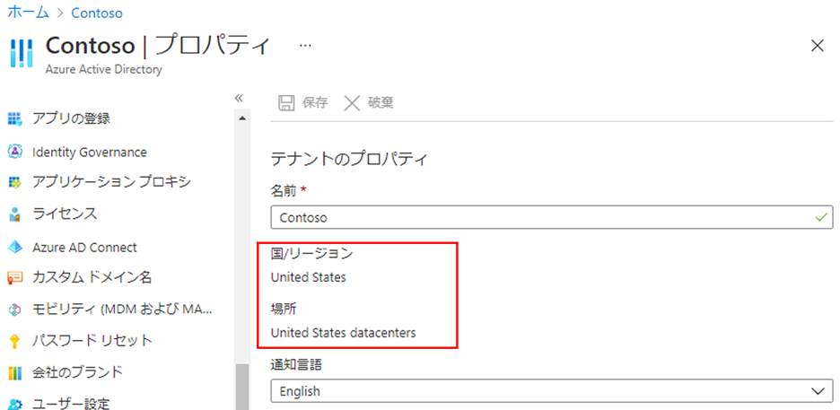
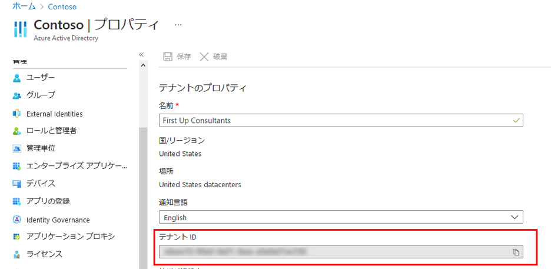
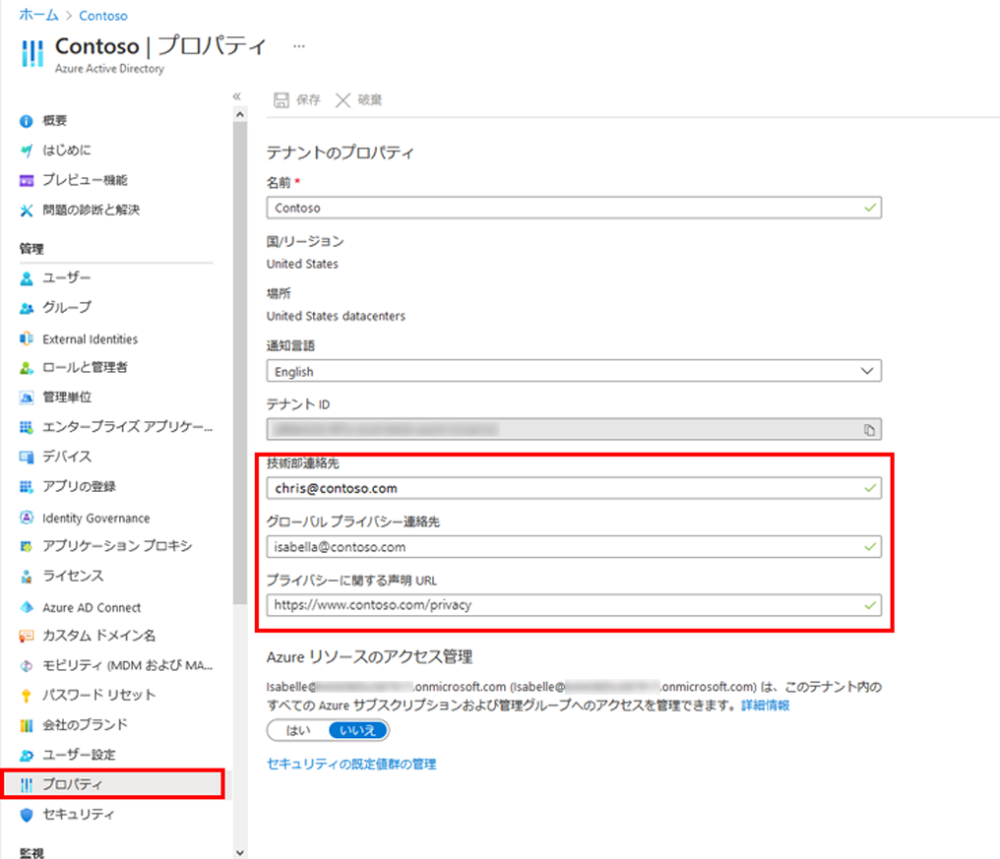
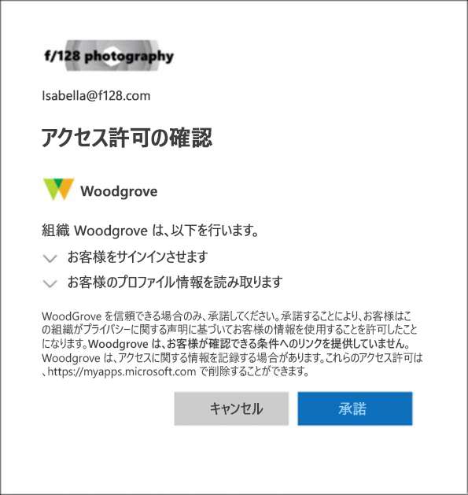

---
lab:
    title: '02 - テナントのプロパティを操作する'
    learning path: '01'
    module: 'モジュール 01 – ID 管理ソリューションを実装する'
---

# ラボ 02: テナントのプロパティを操作する

## ラボ シナリオ

テナントに関連付けられているさまざまなプロパティを特定し、更新する必要があります。

#### 推定時間: 10 分

## テナントの表示名を変更する

1. ディレクトリのグローバル管理者アカウントを使用して [https://portal.azure.com](https://portal.azure.com) を参照し、サインインします。

1. **「ポータル メニューの表示」** ハンバーガー アイコンを選択し、**「Azure Active Directory」** を選択します。

    

1. 左側のナビゲーションの「管理」セクションで **「プロパティ」** を選択します。

1. **「名前」** ボックスで、テナント名を変更します。たとえば、Contoso Marketing Company を Contoso Marketing Company 2 に変更することができます。

1. **「保存」** を選択してテナント プロパティを更新します。

## テナントに関連付けられている国または地域を見つける

1. **「Azure Active Directory」** ブレードの「管理」セクションで、**「プロパティ」** を選択します。

1. **「テナントのプロパティ」** で、**「国または地域」** を見つけて、情報を確認します。

    > [!重要]
    > テナントが作成されると、その時点で国または地域が指定されます。この設定は後で変更できます。

## テナントに関連付けられている場所を検索する

Azure Active Directory の「プロパティ」ブレードで国または地域を検索できるのと同様に、場所情報も検索できます。

1. **「プロパティ」** ブレードの **「テナントのプロパティ」** で、**「場所」** を見つけて情報を確認します。

    

## テナント ID を見つける

Azure サブスクリプションには、Azure Active Directory (Azure AD) との信頼関係があります。サブスクリプションでは、ユーザー、サービス、デバイスを認証するために Azure AD が信頼されます。各サブスクリプションには、それに関連付けられているテナント ID があり、いくつかの方法で、お使いのサブスクリプションのテナント ID を見つけることができます。

1. **「Azure Active Directory」** ブレードの「管理」セクションで、**「プロパティ」** を選択します。

1. **「テナントのプロパティ」** で、**「テナント ID」** を見つけます。これは一意のテナント識別子です。

    

## 技術部連絡先を変更し、プライバシー情報、グローバル プライバシー連絡先、プライバシーに関する声明の URL を Azure AD に追加する

Microsoft では、社内の従業員と外部のゲストがポリシーを確認できるように、グローバル プライバシー連絡先と組織のプライバシーに関する声明の両方を追加することを強くお勧めします。プライバシーに関する声明はそれぞれの会社に合わせて独自に作成､変更されるため､弁護士に相談することを強くお勧めします｡

    > [!注]
    > 個人データの表示または削除については、[https://docs.microsoft.com/microsoft-365/compliance/gdpr-dsr-azure](https://docs.microsoft.com/microsoft-365/compliance/gdpr-dsr-azure) を参照してください。GDPR の詳細については、[https://servicetrust.microsoft.com/ViewPage/GDPRGetStarted](https://servicetrust.microsoft.com/ViewPage/GDPRGetStarted) を参照してください。

組織のプライバシー情報は、Azure AD の **「プロパティ」** エリアで追加します。「プロパティ」エリアにアクセスしてプライバシー情報を追加するには:

1. **「Azure Active Directory」** ブレードの「管理」セクションで、**「プロパティ」** を選択します。

    

1. 従業員のプライバシー情報を追加します｡

- **技術部連絡先**。社内の技術的なサポートを受けるさいの連絡先の電子メール アドレスを入力します｡

- **グローバル プライバシー連絡先**。個人データのプライバシーに関する問い合わせをするさいの連絡先の電子メール アドレスを入力します｡この連絡先は､データに関する違反があった場合に Microsoft が問い合わせを行う連絡先でもあります｡問い合わせの記載がない場合､Microsoft はグローバル管理者に問い合わせます｡

- **プライバシーに関する声明の URL**。組織が社内と外部のゲストの両方のデータのプライバシーをどのように処理するかを説明している組織のドキュメントへのリンクを入力します。

    > [!重要]
    > プライバシーに関する独自の声明とプライバシー連絡先のどちらも含めていない場合は、外部のゲストの「アクセス許可の確認」ボックスに、「\<your org name\> ではレビューするための条件へのリンクが提供されていません」というテキストが表示されます。たとえば､このメッセージは､B2B コラボレーションでゲスト ユーザーが組織にアクセスするための招待を受けたときに表示されます｡

    

1. **「保存」** を選択します。
