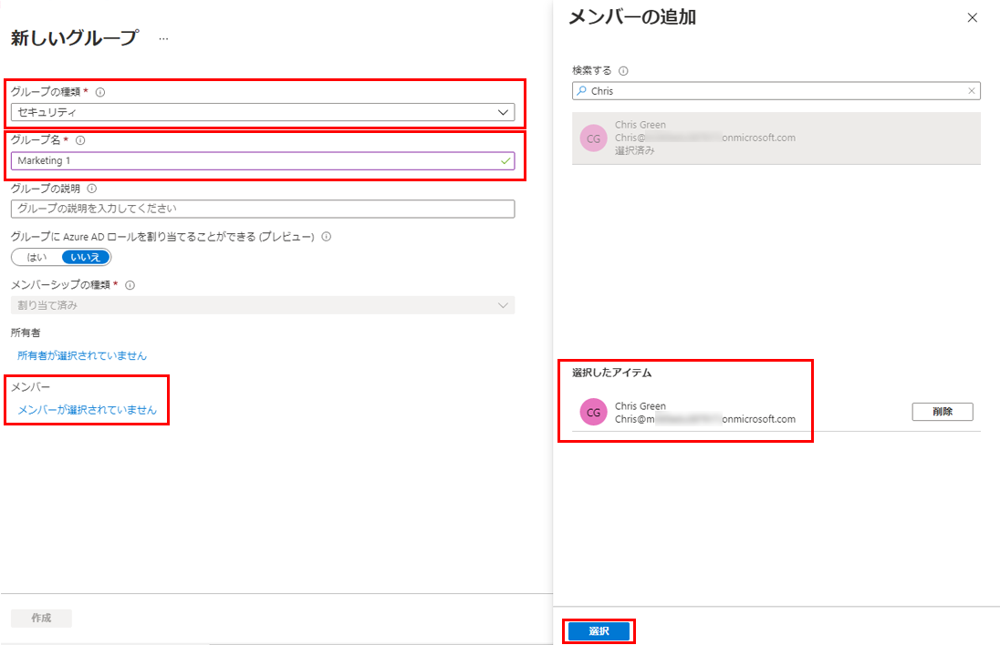
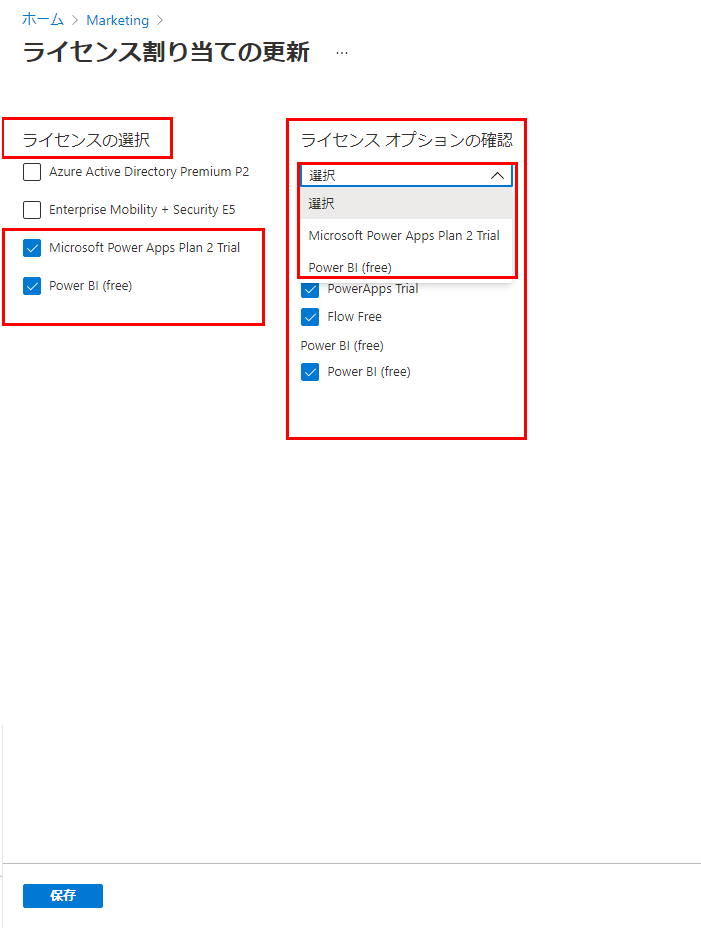

---
lab:
    title: '03 - グループ メンバーシップを使用してライセンスを割り当てる'
    learning path: '01'
    module: 'モジュール 02 - ID の作成、構成、管理を行う'
---

# ラボ 03: グループ メンバーシップを使用してライセンスを割り当てる

## ラボ シナリオ

あなたの組織は Azure AD のセキュリティ グループを使用してライセンスを管理することに決めました。新しいセキュリティを設定し、そのグループにライセンスを割り当て、グループ メンバーのライセンスが更新されたことを確認する必要があります。

#### 推定時間: 10 分

## Azure Active Directory で新しいユーザーを作成する

1. [https://portal.azure.com/#blade/Microsoft_AAD_IAM/ActiveDirectoryMenuBlade/Overview]( https://portal.azure.com/#blade/Microsoft_AAD_IAM/ActiveDirectoryMenuBlade/Overview) を参照して、グローバル管理者としてサインインします。

1. 左側のナビゲーション メニューの **「管理」** で、**「ユーザー」** を選択します。

1. 「ユーザー」ブレードのメニューで、**「新しいユーザー」** を選択します。

1. 次の情報を使用してユーザーを作成します。

    | **設定**| **値**|
    | :--- | :--- |
    | ユーザー名| Chris|
    | 名前| Chris Green|
    | 名| Chris|
    | 姓| Green|
    | パスワード| Pass@word1|
    | 利用場所| Japan|
    

1. 完了したら、**「すべてのユーザー」** リストに Chris Green のアカウントが表示されていることを確認します。

## Azure Active Directory でセキュリティ グループを作成する

1. [https://portal.azure.com/#blade/Microsoft_AAD_IAM/ActiveDirectoryMenuBlade/Overview]( https://portal.azure.com/#blade/Microsoft_AAD_IAM/ActiveDirectoryMenuBlade/Overview) を参照します。

1. 左側のナビゲーション メニューの **「管理」** で、**「グループ」** を選択します。

1. 「グループ」ブレードのメニューで、**「新しいグループ」** を選択します。

1. 次の情報を使用して、グループを作成します。

    | **設定**| **値**|
    | :--- | :--- |
    | グループの種類| セキュリティ|
    | グループ名| Marketing |
    | メンバーシップの種類| 割り当て済み|
    | 所有者| *自分の管理者アカウントをグループの所有者として割り当てる*|
    | メンバー| Chris Green|

    

1. 完了したら、**Marketing** という名前のグループが **「すべてのグループ」** リストに表示されていることを確認します。

## ライセンスをグループに割り当てる

1. **「すべてのグループ」** リストで **Marketing** を選択します。

1. 「Marketing」ブレードの **「管理」** で **「ライセンス」** を選択します。

1. メニューで **「割り当て」** を選択します。

1. 「ライセンス割り当ての更新」ブレードの **「ライセンスの選択」** で、使用可能なライセンスのリストを確認し、ライセンスの 1 つのチェック ボックスをオンにします。

1. **「Review license」** (ライセンスの確認) オプションで、選択したライセンスの利用可能なオプションを確認します。

    >[!ヒント]
    >・ 複数のライセンスが選択されている場合は、「Review license」 (ライセンスの確認) オプション メニューを使用して特定のライセンスを選択し、そのライセンスのライセンス オプションを表示できます。
    >
    >・ ライセンス数上限により、割り当てに失敗する場合は Lidia Holloway ユーザーと Diego Siciliani ユーザーのから、これから使用するライセンス割り当てを削除してください。

    

1. **「保存」** を選択します。
