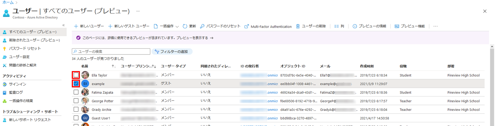

---
lab:
    title: '04 - 削除済みユーザーの復元'
    learning path: '01'
    module: 'モジュール 02 - ID の作成、構成、管理を行う'
---

# ラボ 04: 削除済みユーザーの復元

## ラボ シナリオ

アカウントを削除した後、復元する必要がある場合があります。最近削除されたアカウントを復元できるかどうかを確認する必要があります。

#### 推定時間: 5 分

## Azure Active Directory からユーザーを削除する

1. [https://portal.azure.com/#blade/Microsoft_AAD_IAM/ActiveDirectoryMenuBlade/Overview]( https://portal.azure.com/#blade/Microsoft_AAD_IAM/ActiveDirectoryMenuBlade/Overview) を参照します。

1. 左側のナビゲーション メニューの **「管理」** で、**「ユーザー」** を選択します。

1. **「ユーザー」** リストで、削除するユーザーのチェック ボックスをオンにします。たとえば、**Chris Green** を選択します。

    >[!ヒント]
    >リストからユーザーを選択すると、複数のユーザーを同時に管理できます。ユーザーを選択してそのユーザーのブレードを開いた場合は、その個々のユーザーのみを管理します。

    

1. ユーザー アカウントを選択した状態で、メニューの **「ユーザーの削除」** を選択します。

1. ダイアログ ボックスを確認してから、**「OK」** を選択します。

## 削除済みユーザーの復元

1. 「ユーザー」ブレードの左側のナビゲーションで、**「削除済みのユーザー」** を選択します。

1. 削除したユーザーのリストを確認し、削除したばかりのユーザーを選択します。

    >[!重要]
    >既定では、削除されたユーザー アカウントは 30 日後に自動的に Azure Active Directory から完全に削除されます。

1. メニューで **「ユーザーの復元」** を選択します。

1. ダイアログ ボックスを確認してから、**「OK」** を選択します。

1. 左側のナビゲーション バーで、**「すべてのユーザー」** を選択します。

1. ユーザーが復元されたことを確認します。
