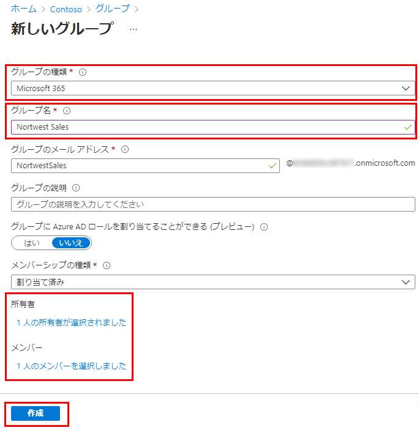

---
lab:
    title: '05 - Azure AD にグループを追加する'
    learning path: '01'
    module: 'モジュール 02 - ID の作成、構成、管理を行う'
---

# ラボ 05: Azure AD にグループを追加する

## ラボ シナリオ

Azure AD 管理者としての職務の一環として、さまざまな種類のグループを作成することがあります。組織の営業部門用に新しい Microsoft 365 グループを作成する必要があります。

#### 推定時間: 5 分

## Azure Active Directory で Office 365 アプリケーションを作成する

1. [https://portal.azure.com/#blade/Microsoft_AAD_IAM/ActiveDirectoryMenuBlade/Overview]( https://portal.azure.com/#blade/Microsoft_AAD_IAM/ActiveDirectoryMenuBlade/Overview) を参照します。

1. 左側のナビゲーション メニューの **「管理」** で、**「グループ」** を選択します。

1. 「グループ」ブレードのメニューで、**「新しいグループ」** を選択します。

1. 次の情報を使用して、グループを作成します。

    | **設定**| **値**|
    | :--- | :--- |
    | グループの種類| Microsoft 365|
    | グループ名| Northwest Sales|
    | メンバーシップの種類| 割り当て済み|
    | 所有者| *自分の管理者アカウントをグループの所有者として割り当てる*|
    | メンバー| *このグループのメンバーを割り当てる*|

    

1. 完了したら、**Northwest sales** という名前のグループが **「すべてのグループ」** リストに表示されていることを確認します。
