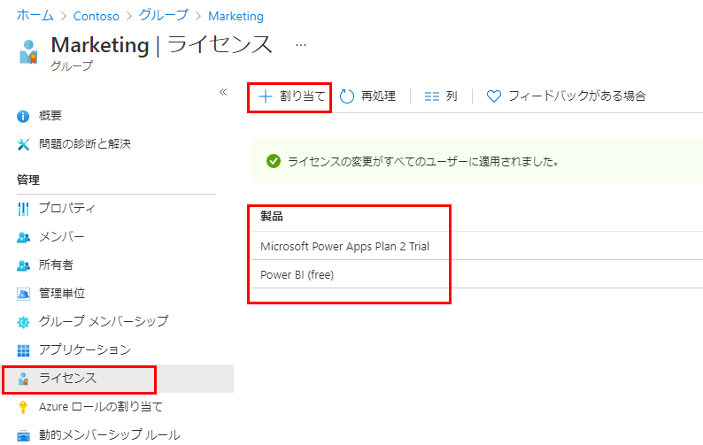

---
lab:
    title: '06 - グループ ライセンス割り当てを変更する'
    learning path: '01'
    module: 'モジュール 02 - ID の作成、構成、管理を行う'
---

# ラボ 06: グループ ライセンス割り当てを変更する

## ラボ シナリオ

時折、Azure AD セキュリティ グループで使用されているライセンスの割り当てを変更する必要があります。グループのライセンス割り当てを変更する手順を確実に理解しておく必要があります。

#### 推定時間: 5 分

## グループ ライセンス割り当てを変更する

1. [https://portal.azure.com/#blade/Microsoft_AAD_IAM/ActiveDirectoryMenuBlade/Overview]( https://portal.azure.com/#blade/Microsoft_AAD_IAM/ActiveDirectoryMenuBlade/Overview) を参照します。

1. 左側のナビゲーション メニューの **「管理」** で、**「グループ」** を選択します。

1. 使用可能ないずれかのグループを選択します。たとえば、Marketing です。

1. 左側のナビゲーション メニューの **「管理」** で、**「ライセンス」** を選択します。

1. 現在の割り当てを確認し、メニューの **「+ 割り当て」** を選択します。

    

1. 「ライセンスの割り当ての更新」ブレードで、別のライセンスを選択するか、既存のライセンスの選択を解除するか、ライセンス オプションを追加または削除します。これらを組み合わせることもできます。

1. 完了したら、**「保存」** を選択します。

1. グループの [ライセンス] ページで、変更を確認します。
