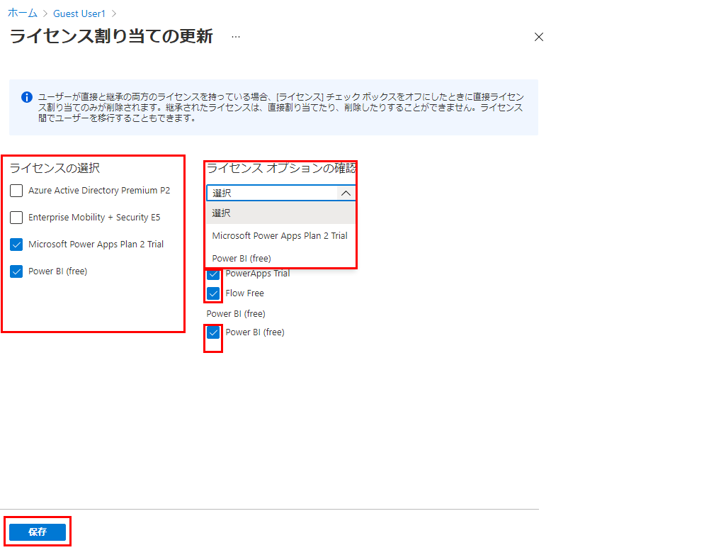

---
lab:
    title: '07 - ユーザー ライセンス割り当てを変更する'
    learning path: '01'
    module: 'モジュール 02 - ID の作成、構成、管理を行う'
---

# ラボ 07: ユーザー ライセンス割り当てを変更する

## ラボ シナリオ

組織内の一部のユーザー アカウントには、割り当てられたライセンスで利用可能なすべての製品が提供されない場合や、ライセンス割り当ての更新または追加が必要な場合があります。Azure AD でユーザー アカウントのライセンス割り当てを更新できるようにする必要があります。

#### 推定時間: 5 分

## Azure Active Directory で新しいユーザーを作成する

1. [https://portal.azure.com/#blade/Microsoft_AAD_IAM/ActiveDirectoryMenuBlade/Overview]( https://portal.azure.com/#blade/Microsoft_AAD_IAM/ActiveDirectoryMenuBlade/Overview) を参照します。

1. 左側のナビゲーション メニューの **「管理」** で、**「ユーザー」** を選択します。

1. 「ユーザー」ブレードのメニューで、**「新しいユーザー」** を選択します。

1. 次の情報を使用してユーザーを作成します。

    | **設定**| **値**|
    | :--- | :--- |
    | ユーザー名| Dominique|
    | 名前| Dominique Koch|
    | 名| Dominique|
    | 姓| Koch|
    | パスワード| Pass@word1|
    | 利用場所| *優先する利用場所を選択します*|

    >警告
    >ユーザーにライセンスを割り当てるには、ユーザーに利用場所が割り当てられている必要があります。

1. 完了したら、**「すべてのユーザー」** リストに Chris Green のアカウントが表示されていることを確認します。

## ユーザー ライセンスの割り当てを更新する

1. [https://portal.azure.com/#blade/Microsoft_AAD_IAM/ActiveDirectoryMenuBlade/Overview]( https://portal.azure.com/#blade/Microsoft_AAD_IAM/ActiveDirectoryMenuBlade/Overview) を参照します。

1. 左側のナビゲーション メニューの **「管理」** で、**「ユーザー」** を選択します

1. 「ユーザー」ブレードで、**Dominique Koch** を選択します。

1. 左側のナビゲーションで、**「ライセンス」** を選択します。

1. 「ライセンスの割り当ての更新」ブレードで、1 つまたは複数のライセンスのチェック ボックスをオンにします。

    

1. 完了したら、**「保存」** を選択します。
