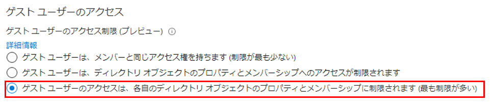
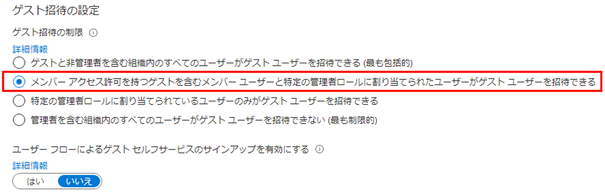

---
lab:
    title: '08 - 外部コラボレーションの設定を構成する'
    learning path: '01'
    module: 'モジュール 03 - 外部 ID の実装と管理を行う'
---

# ラボ 08: 外部コラボレーションの設定を構成する

## ラボ シナリオ

承認されたゲストがアクセスするには、組織の外部コラボレーション設定を有効にする必要があります。

#### 予想時間: 5 分

### 外部コラボレーションの設定を構成する

1. [https://portal.azure.com](https://portal.azure.com) にテナント管理者としてサインインします。

1. **「Azure Active Directory」** を選択します。

1. **「External Identities > 外部コラボレーション設定」** を選択します。

1. **「Guest user access」** (ゲスト ユーザー アクセス) で、使用可能なアクセス レベルを確認し、**「Guest user access is restricted to properties and memberships of their own directory objects (most restrictive)」** (ゲスト ユーザーのアクセスを、自分のディレクトリ オブジェクトのプロパティとメンバーシップに制限する (最も厳しい制限)) を選択します。

    > [!注]
    >
    >- Guest users have the same access as members (most inclusive) (ゲスト ユーザーにメンバーと同じアクセス権を付与する (最も包括的)): このオプションを選択すると、ゲストがメンバー ユーザーと同じように Azure AD リソースとディレクトリ データにアクセスできるようになります。
    >- Guest users have limited access to properties and memberships of directory objects (ゲスト ユーザーに対してディレクトリ オブジェクトのプロパティとメンバーシップへのアクセスを制限する): (デフォルト) この設定を選択すると、ゲストは、特定のディレクトリ タスク (ユーザー、グループ、またはその他のディレクトリ リソースを列挙するなど) を実行できなくなります。ゲストは、非表示でないすべてのグループのメンバーシップを表示できます。
    >- Guest user access is restricted to properties and memberships of their own directory objects (most restrictive) (ゲスト ユーザーのアクセスを、自分のディレクトリ オブジェクトのプロパティとメンバーシップに制限する (最も厳しい制限)): この設定では、ゲストは自分のプロファイルのみにアクセスできます。ゲストは、他のユーザーのプロファイル、グループ、またはグループ メンバーシップを参照することはできません。

    

1. **「Guest invite settings」** (ゲスト招待の設定) で **「メンバー アクセス許可を持つゲストを含むメンバー ユーザーと特定の管理者ロールに割り当てられたユーザーがゲスト ユーザーを招待できる」** を選択します。

    > [!注]
    > 管理者とゲスト招待元ロールのユーザーは招待ができる: 管理者と 「ゲスト招待元」 ロールのユーザーがゲストを招待できるようにするには、このポリシーを「はい」に設定します。
    > メンバーは招待ができる: ディレクトリ内の管理者以外のメンバーがゲストを招待できるようにするには、このポリシーを「はい」に設定します。
    > ゲストは招待ができるゲストが他のゲストを招待できるようにするには、このポリシーを「はい」に設定します。
    > ユーザー フローによるゲストのセルフサービス サインアップを有効にする (プレビュー): ディレクトリ内のアプリケーションに関連付けられているユーザー フローを介してゲストのセルフサービス サインアップを有効または無効にします。無効にした場合、ゲストはディレクトリに招待される必要があります。
    > 「メンバーは招待ができる」が「いいえ」に設定され、「管理者とゲスト招待元ロールのユーザーは招待ができる」が「はい」に設定されている場合、ゲスト招待元ロールのユーザーは引き続きゲストを招待できます。

    

1. **「Email one-time passcode for guests」** (ゲストのメール ワンタイム パスコード) で、既定の設定を使用します。

    >[!注]
    >
    >- 2021 年 3 月に、ゲストのメール ワンタイム パスコードを自動的に有効にします。(デフォルト) メール ワンタイム パスコード機能がテナントに対してまだ有効になっていない場合は、2021 年 3 月に自動的に有効になります。その時点で機能を有効にする場合は、それ以上の操作は必要ありません。この機能を既に有効または無効にしている場合、このオプションは使用できません。
    >- ゲストのメール ワンタイム パスコードは現在有効です。テナントのメール ワンタイム パスコード機能を有効にします。
    >- ゲストのメール ワンタイム パスコードを無効にします。テナントに対してメール ワンタイム パスコード機能を無効にし、2021 年 3 月にこの機能が有効にならないようにします。

1. **「Collaboration restrictions」** (コラボレーションの制限) で、使用可能なオプションを確認し、既定の設定をそのまま使用します。

    > [!重要]
    > 許可リストまたは拒否リストのいずれかを作成できます。両方の種類のリストを設定することはできません。既定では、許可リストに含まれないドメインはすべて拒否リストに含まれます。また、その逆も言えます。
    > 各組織に作成できるポリシーは 1 つだけです。ポリシーを更新してより多くのドメインを含めることも、ポリシーを削除して新規に作成することもできます。
    > 許可リストまたは拒否リストに追加できるドメインの数は、ポリシーのサイズによってのみ制限されます。ポリシー全体の最大サイズは 25 KB (25,000 文字) です。これには、許可リストまたは拒否リストと、他の機能向けに構成された他のパラメーターが含まれます。
    > このリストは、OneDrive for Business や SharePoint Online の許可/ブロック リストとは無関係に機能します。SharePoint Online で個々のファイルの共有を制限する場合は、OneDrive for Business および SharePoint Online の許可リストまたは拒否リストを設定する必要があります。
    > このリストは、招待を既に使用した外部ユーザーには適用されません。リストは、リストの設定後に適用されます。ユーザーの招待が保留中の状態にあり、ドメインをブロックするポリシーを設定した場合、ユーザーが招待の使用を試みると失敗します。

1. 完了したら、変更を保存します。
