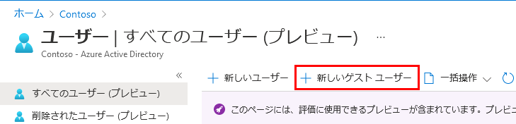

---
lab:
    title: '09 - ゲスト ユーザーをディレクトリに追加する'
    learning path: '01'
    module: 'モジュール 03 - 外部 ID の実装と管理を行う'
---

# ラボ 09: ゲスト ユーザーをディレクトリに追加する

## ラボ シナリオ

あなたの会社は多くのベンダーと協力していますが、場合によっては、ベンダーのアカウントをゲストとしてディレクトリに追加する必要があります。

#### 推定時間: 5 分

## ゲスト ユーザーをディレクトリに追加する

1. 制限付き管理者ディレクトリ ロールまたはゲストの招待元ロールが割り当てられたユーザーとして、[https://portal.azure.com](https://portal.azure.com) にサインインします。

1. **「Azure Active Directory」** を選択します。

1. **「管理」**で、**「ユーザー」** を選択します。

1. **「新しいゲスト ユーザー」** を選択します。

    

1. 「新しいユーザー」ページで **「ユーザーの招待」** を選択し、ゲスト ユーザーの情報を追加します。

    > [!注]
    > グループのメール アドレスはサポートされていません。個人のメール アドレスを入力してください。また、一部の電子メール プロバイダーでは、ユーザーはプラス記号 (+) と追加テキストを電子メール アドレスに付け加えて、受信ボックスのフィルター処理などに役立てることができます。ただし、Azure AD では現在、電子メール アドレスのプラス記号はサポートされていません。配信の問題を回避するために、プラス記号と、それに続く @ 記号より前の任意の文字を含めません。

1. 完了したら、**「招待する」** を選択します。

1. 「ユーザー」ブレードで、アカウントが一覧表示されていることを確認し、**「ユーザーの種類」** 列に **「ゲスト」** が表示されていることを確認します。

招待状を送信すると、ユーザー アカウントがゲストとしてディレクトリに自動的に追加されます。
