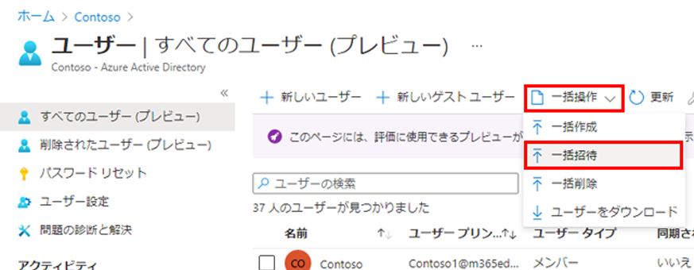
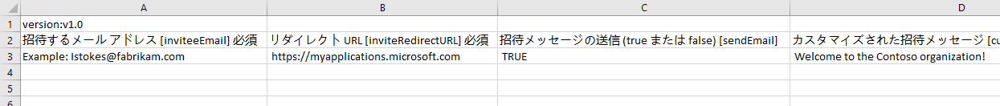
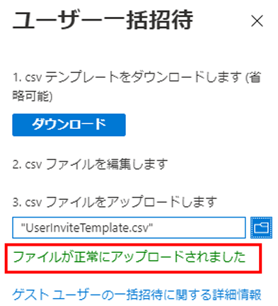
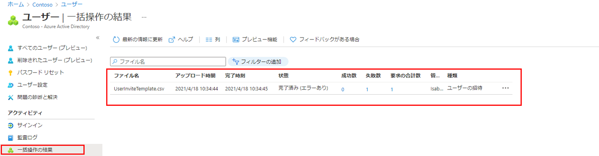

---
lab:
    title: '10 - ゲスト ユーザーを一括招待する'
    learning path: '01'
    module: 'モジュール 03 - 外部 ID の実装と管理を行う'
---

# ラボ 10: ゲスト ユーザーを一括招待する

## ラボ シナリオ

最近では、他社との提携が行われています。当面は、パートナー企業の従業員がゲストとして追加されます。複数のゲスト ユーザーを一度にインポートできるようにする必要があります。

#### 推定時間: 10 分

## ゲスト ユーザーを一括招待する

1. 組織のユーザー管理者アカウントで、[https://portal.azure.com](https://portal.azure.com) にサインインします。

1. 左側のナビゲーション ウィンドウから、**「Azure Active Directory」** を選択します。

1. **「管理」** から、**「ユーザー」** を選択します。

1. 「ユーザー」ブレードのメニューで、**「一括操作」 > 「一括招待」** を選択します。

     

1. 「ユーザー一括招待」ウィンドウで、招待プロパティを持つサンプル CSV テンプレートへの **「ダウンロード」** を選択します。

1. エディターを使用して CSV ファイルを表示し、テンプレートを確認します。

1. この .csv テンプレートを開いて、ゲスト ユーザーごとに 1 行追加します。必要な値は次のとおりです。

    - **招待するメール アドレス** - 招待が送信されるユーザー

    - **リダイレクト URL** - 招待されたユーザーが招待を承認した後に転送される URL。

    

1. ファイルを保存します。

1. 「ユーザー一括招待」ページの **「CSV ファイルをアップロード」** で、そのファイルを参照します。

ファイルを選択すると、.csv ファイルの検証が開始されます。

1. ファイルの内容が検証された後、**「ファイルが正常にアップロードされました」** と表示されます。エラーが存在する場合は、ジョブを送信する前にそれらを修正する必要があります。

    

1. ファイルが検証に合格したら、**「送信」** を選択して、招待を追加する Azure の一括操作を開始します。

1. ジョブの状態を表示するには、**「Click here to view the status of each operation」** (各操作の状態を表示するには、ここをクリックします) を選択します。または、「アクティビティ」セクションの **「Bulk operation results」** (一括操作の結果) を選択します。一括操作に含まれる各行の項目の詳細については、**「成功数」**、**「失敗数」**、**「合計要求数」** 列の値を選択してください。エラーが発生した場合、その理由が表示されます。

    

1. ジョブが完了すると、一括操作が成功したという通知が表示されます。
