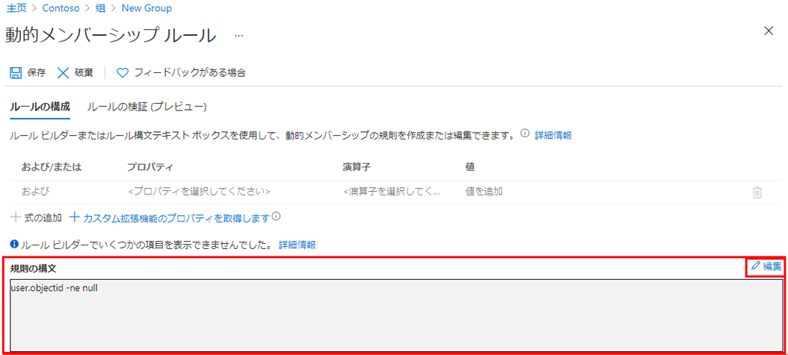

---
lab:
    title: '11 - 動的グループを使用する'
    learning path: '01'
    module: 'モジュール 03 - 外部 ID の実装と管理を行う'
---

# ラボ 11: 動的グループを使用する

## ラボ シナリオ

会社の規模が大きくなると、手作業でのグループ管理は時間がかかりすぎます。ディレクトリを標準化したことで、動的グループを活用できるようになりました。運用環境で動的グループを作成できるようにするためには、新しい動的グループを作成する必要があります。

#### 推定時間: 10 分

## すべてのユーザーをメンバーとして持つ動的グループを作成する

1. テナントのグローバル管理者またはユーザー管理者ロールが割り当てられたアカウントで [https://portal.azure.com](https://portal.azure.com) にサインインします。

1. **Azure Active Directory** を選択します。

1. **「管理」** の下の **「グループ」** を選択し、**「新しいグループ」** を選択します。

1. 「新しいグループ」ページで、**「グループの種類」** の下の **「セキュリティ」** を選択します。

1. **「グループ名」** ボックスに、**「All company users dynamic group」** (すべての会社ユーザーの動的グループ) と入力します。

1. **「メンバーシップの種類」** メニューを選択し、**「動的ユーザー」** を選択します。

1. **「動的なユーザー メンバー」** で、**「動的クエリの追加」** を選択します。

1. **「ルール構文」** ボックスの上にある **「編集」** を選択します。

1. 「ルール構文の編集」ウィンドウで、**「ルール構文」** ボックスに次の式を入力します。

    ```powershell
    user.objectId -ne null
    ```

1. **「OK」** を選択します。「ルール構文」ボックスにルールが表示されます。

    

1. **「保存」** を選択します。これで、新しい動的グループには、B2B ゲスト ユーザーとメンバー ユーザーが含まれるようになります。

1. 「新規グループ」ページで **「作成」** を選択して、グループを作成します。
