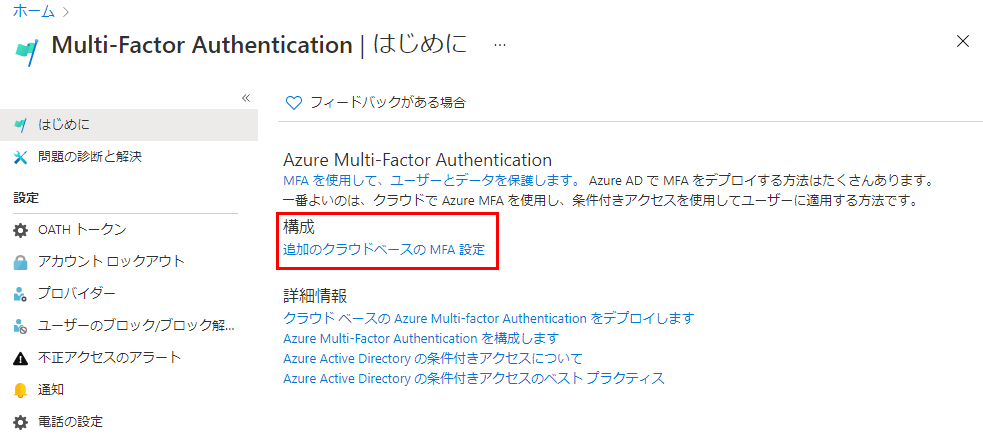
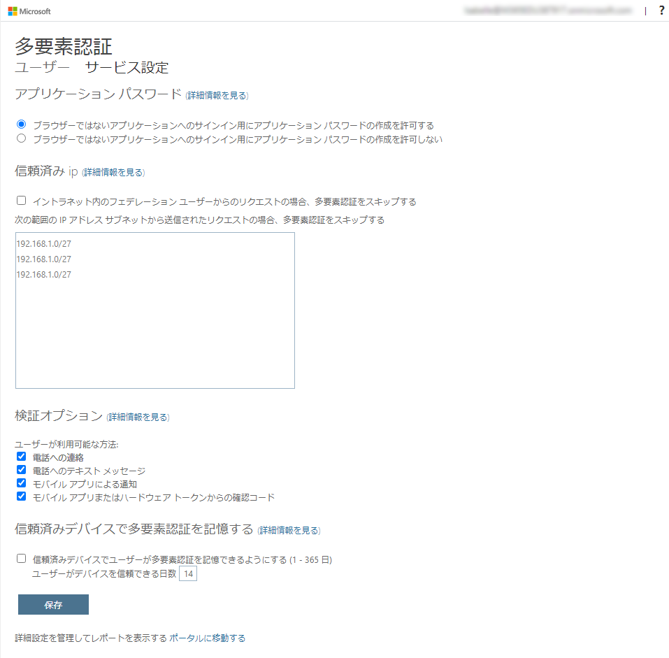
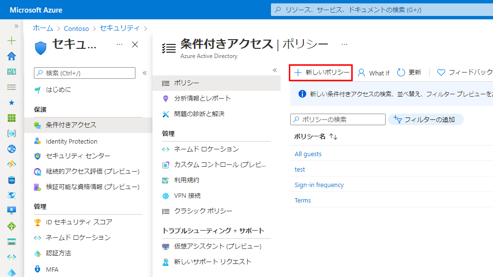
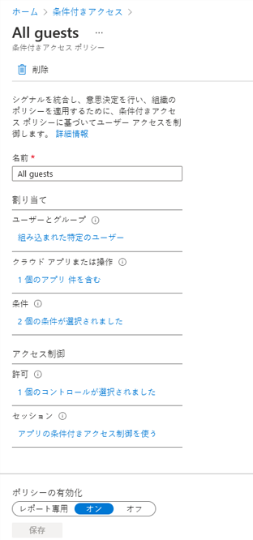
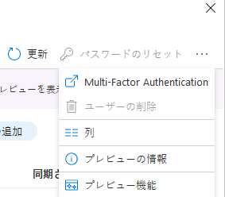
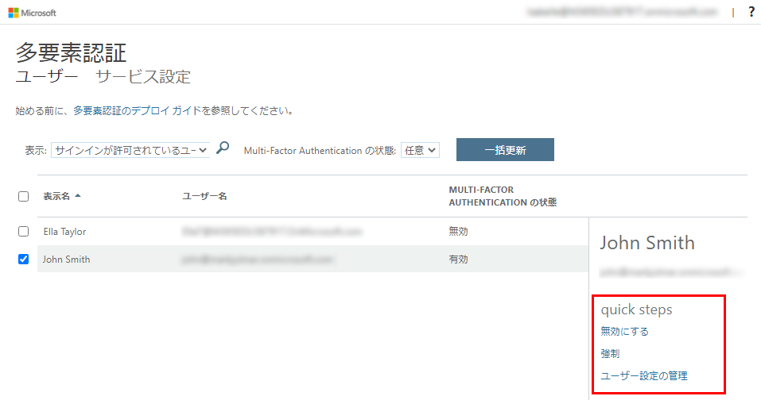

---
lab:
    title: '12 - Azure AD の Multi-Factor Authentication を有効にする'
    learning path: '02'
    module: 'モジュール 01 - Azure Multi-Factor Authentication の計画と管理を行う'
---

# ラボ 12 - Azure AD の Multi-Factor Authentication を有効にする

## ラボ シナリオ

組織のセキュリティを向上させるために、Azure Active Directory の多要素認証を有効にするよう指示されています。

#### 推定時間: 10 分

>[!重要]
>この演習には Azure AD Premium が必要です。30 日間の無料試用版を利用し、この機能を試すことができます。あるいは、下の指示を最後まで読み、流れを理解してください。

## Multi-Factor Authentication オプションを構成する

1. ディレクトリのグローバル管理者アカウントを使用して [https://portal.azure.com](https://portal.azure.com) を参照し、サインインします。

1. 検索機能を使用して、**「multi-factor」** を検索します。

1. 検索結果で、「**Multi-Factor Authentication**」 を選択します。

1. 「はじめに」ページの **「構成」** で、**「追加のクラウドベースの MFA 設定」** を選択します。

    

1. 新しいブラウザー ページには、Azure ユーザーの MFA オプションとサービス設定が表示されます。

    

    ここで、サポートされている認証方法を選択します。上の画面では、すべてが選択されています。

    ここでは「アプリ パスワード」の有効/無効を切り替えることもできます。これにより、多要素認証がサポートされないアプリに対して一意のアカウント パスワードを作成できます。この機能を使うと、ユーザーはそのアプリに固有となる別のパスワードを利用し、Azure AD の ID で認証することができます。

## MFA の条件付きアクセス ルールを設定する

次に、ネットワークにある特定のアプリにアクセスするゲスト ユーザーに MFA を強制する条件付きアクセス ポリシー ルールを設定する方法を確認してみましょう。

1. Azure portal に戻り、**「Azure Active Directory」** > **「セキュリティ」** > **「条件付きアクセス」** の順に選択します。

1. メニューで **「新しいポリシー」** を選択します。

    

1. ポリシーに名前を付けます。たとえば、**「すべてのゲスト」** にします。

1. **「ユーザーとグループ」** を選択します。

    - **「ユーザーとグループの選択」** を選択します  
    - **「すべてのゲストと外部ユーザー」** チェック ボックスをオンにし、これをすべてのゲストに適用します。  
    - **「完了」** を選択します。  

1. **「クラウド アプリまたは操作」** を選択します。

    - **「アプリを選択」** を選択します。  
    - Visual Studio App Center など、Azure AD MFA を有効にするアプリを選択します。  
    - **「選択」** を選択し、**「完了」** を選択します。

1. 「条件」セクションを確認します。

    - **「場所」** を選択し、**「すべての場所」** に対して構成します。

1. **「アクセス制御」** で **「許可」** を選択し、**「アクセスを許可する」** が選択されていることを確認します。

1. **「多要素認証を要求する」** チェック ボックスをオンにして、MFA を適用します。

1. **「選択」** を選択します。

1. **「ポリシーの有効化」** を **「オン」** に設定します。

1. **「作成」** を選択し、ポリシーを作成します。

    

    これで、選択したアプリケーションに対して MFA が有効になりました。次回、ゲストがそのアプリにサインインしようとすると、MFA の登録が求められます。

## パスワードについて Azure AD MFA を構成する

最後に、ユーザー アカウントに対して MFA を構成する方法を見ていきましょうこれは多要素認証設定にアクセスするもう 1 つの方法です。

1. Azure portal で Azure Active Directory ダッシュボードに戻ります。

1. **「ユーザー」** を選択します。

1. 「ユーザー」ウィンドウの一番上で、**「Multi-Factor Authentication」** を選択します。

    

    ユーザーを選択し、右側にあるクイック手順を利用することで、ユーザー ベースで MFA の有効/無効を切り替えることができます。

    

1. **「サービス設定」** を選択します。  
    これで、前に見たものと同じグローバル MFA オプションが表示されます。以上についてもう少し詳しく見ていきましょう。
