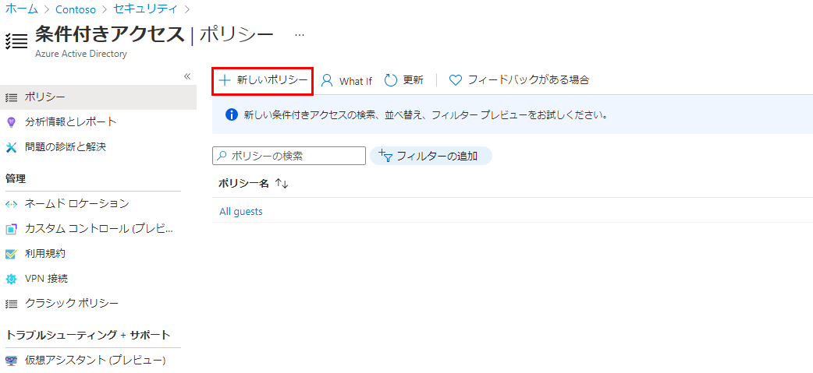
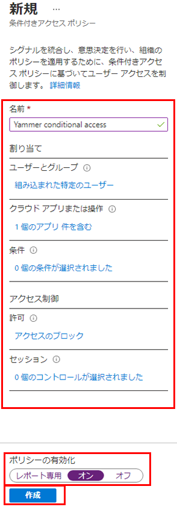
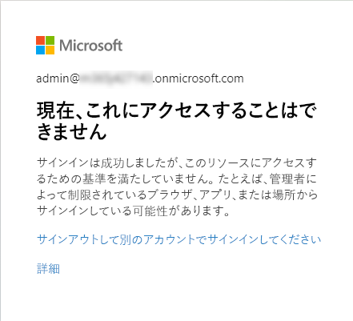

---
lab:
    title: '15 - 条件付きアクセス ポリシーの実装とテストを行う'
    learning path: '02'
    module: 'モジュール 03 -条件付きアクセスの計画、実装、管理を行う'
---

# ラボ 15 - 条件付きアクセス ポリシーの実装とテストを行う

## ラボ シナリオ

組織では、内部アプリケーションへのユーザーのアクセスを制限する必要があります。Azure Active Directory 条件付きアクセス ポリシーをデプロイする必要があります。

#### 推定時間: 10 分

## 条件付きアクセス ポリシーを作成する

Azure Active Directory 条件付きアクセスは Azure AD の高度な機能です。これにより、どのユーザーがリソースにアクセスできるかを制御する詳細なポリシーを指定できます。条件付きアクセスを使用すると、グループ、デバイスの種類、場所、ロールなどに基づいてユーザーのアクセスを制限することでアプリケーションを保護できます。

1. ディレクトリのグローバル管理者アカウントを使用して [https://portal.azure.com](https://portal.azure.com) を参照し、サインインします。

1. ポータル メニューを開き、**「Azure Active Directory」** を選択します。

1. 「Azure Active Directory」 ブレードで、**「管理」** の下にある **「セキュリティ」** を選択します。

1. 「セキュリティ」ブレードの左側のナビゲーションで **「条件付きアクセス」** を選択します。

1. 上部メニューで **「新しいポリシー」** を選択します。

    

1. **「名前」** ボックスに **「Yammer 条件付きアクセス」** と入力します。

1. これは、この演習で使用する名前です。必要に応じて、別の名前にすることができます。

1. **「割り当て」** で、**「ユーザーとグループ」** を選択します。

1. 「対象」タブで **「ユーザーとグループ」** チェックボックスをオンにします。

1. 「選択」ウィンドウで管理者アカウントを選択し、**「選択」** を選択します。

1. **「クラウド アプリまたは操作」** を選択します。

1. **「クラウド アプリ」** が選択されていることを確認し、**「アプリの選択」** を選択します。

1. 「選択」ウィンドウで **「Office 365 Yammer」** を選択し、**「選択」** を選択します。

1. **「条件」** を選択し、次に **「条件」** を選択します。

1. **「構成」** で **「はい」** を選択し、**「すべての場所」** を選択します。

1. **「アクセス制御」** で、**「許可」** を選択します。

1. 「許可」ウィンドウで **「アクセスのブロック」** を選択し、**「選択」** を選択します。

    >注
    >このポリシーは演習用にのみ構成されており、条件付きアクセス ポリシーを迅速に実証するために使用されています。

1. **「ポリシーの有効化」** で、**「オン」** を選択してから **「作成」** を選択します。

    

## 条件付きアクセス ポリシーをテストする

条件付きアクセス ポリシーをテストして、想定どおりに動作することを確認する必要があります。

1. 新しいブラウザー タブを開いて [https://www.yammer.com/office365](https://www.yammer.com/office365) に移動します。

     資格情報を入力します。

1. Microsoft Yammer に正常にアクセスできないことを確認します。

    

1. サインインしている場合は、タブを閉じ、1 ～ 2 分待ってから、もう一度やり直してください。

1. タブを閉じ、「条件付きアクセス」ブレードに戻ります。

1. **「Yammer 条件付きアクセス」** ポリシーを選択します。

1. **「ポリシーの有効化」** で **「オフ」** を選択し、**「保存」** を選択します。
