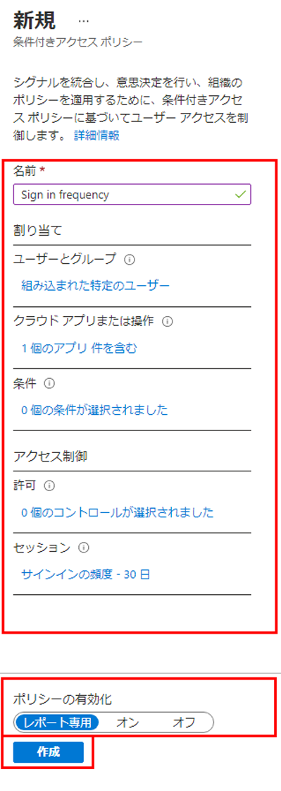

---
lab:
    title: '16 - 認証セッション制御を構成する'
    learning path: '02'
    module: 'モジュール 03 - 条件付きアクセスの計画、実装、管理を行う'
---

# ラボ16 - 認証セッション制御を構成する

## ラボ シナリオ

会社の大規模なセキュリティ構成の一部として、サインインの頻度を制御するために使用できる条件付きアクセス ポリシーをテストする必要があります。

#### 推定時間: 10 分

## 条件付きアクセス ポリシーを使用してサインイン頻度の制御を構成する

1. ディレクトリのグローバル管理者アカウントを使用して [https://portal.azure.com](https://portal.azure.com) を参照し、サインインします。

1. ポータル メニューを開き、**「Azure Active Directory」** を選択します。

1. 「Azure Active Directory」 ブレードで、**「管理」** の下にある **「セキュリティ」** を選択します。

1. 「セキュリティ」ブレードの左側のナビゲーションで **「条件付きアクセス」** を選択します。

1. 上部メニューで **「新しいポリシー」** を選択します。

    

1. **「名前」** ボックスに **「サインインの頻度」** と入力します。

1. **「割り当て」** で、**「ユーザーとグループ」** を選択します。

1. 「対象」タブで **「ユーザーとグループ」** チェックボックスをオンにします。

1. 「選択」ウィンドウで管理者アカウントを選択し、**「選択」** を選択します。

1. **「クラウド アプリまたは操作」** を選択します。

1. **「クラウド アプリ」** が選択されていることを確認し、**「アプリの選択」** を選択します。

1. 「選択」ウィンドウで **「Office 365」** を選択し、**「選択」** を選択します。

1. **「アクセス制御」** で **「セッション」** を選択します。

1. 「セッション」ウィンドウで **「サインインの頻度」** を選択します。

1. 値のボックスに **「30」** と入力します。

1. 単位のメニューを選択し、**「日」**、**「選択」** の順に選択します。

1. **「ポリシーを有効にする」** で **「レポート専用」**、**「作成」** の順に選択します。

    

    >[!注]
    >レポート専用モードは、条件付きアクセス ポリシーの新しい状態です。このモードを使うと、管理者が環境で条件付きアクセス ポリシーを有効にする前に、その影響を評価することができます。レポート専用モードのリリースによる変更点は次のとおりです。
    >
    >- レポート専用モードでは、条件付きアクセス ポリシーを有効にできます。
    >- サインイン中に、レポート専用モードになっているポリシーが評価されますが、強制はされません。
    >- 結果は、サインイン ログの詳細にある「条件付きアクセス」および「レポート専用」タブに記録されます。
    >- Azure Monitor サブスクリプションをお持ちのお客様は、条件付きアクセスに関する分析情報のブックを使用して、条件付きアクセス ポリシーの影響を監視できます。
