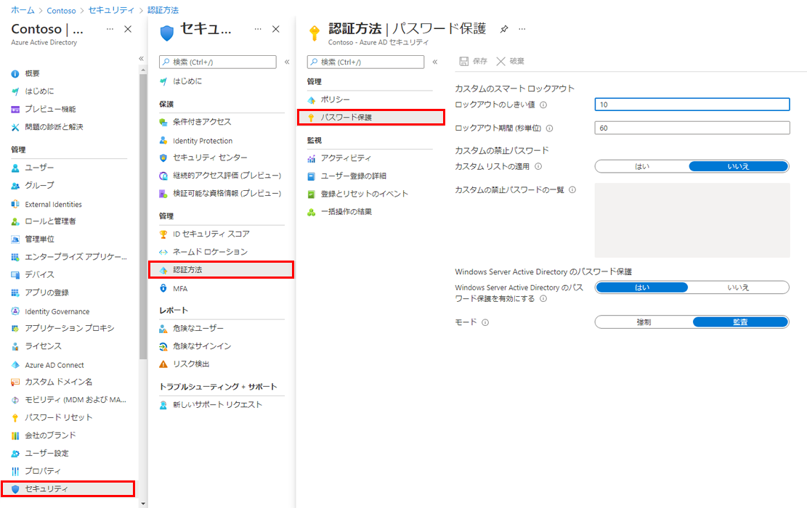

---
lab:
    title: '17 - Azure AD スマート ロックアウトの値を管理する'
    learning path: '02'
    module: 'モジュール 03 - 条件付きアクセスの計画、実装、管理を行う'
---

# ラボ 17 - Azure AD スマート ロックアウトの値を管理する

## ラボ シナリオ

組織の追加のパスワード保護設定を構成する必要があります。

#### 推定時間: 5 分

## Azure AD スマート ロックアウトの値を管理する

組織の要件に基づいて、Azure AD スマート ロックアウトの値をカスタマイズできます。スマート ロックアウト設定を組織固有の値にカスタマイズするには、ユーザーに Azure AD Premium P1 以上のライセンスが必要です。

1. ディレクトリのグローバル管理者アカウントを使用して [https://portal.azure.com](https://portal.azure.com) を参照し、サインインします。

1. ポータル メニューを開き、**「Azure Active Directory」** を選択します。

1. 「Azure Active Directory」 ブレードで、**「管理」** の下にある **「セキュリティ」** を選択します。

1. 「セキュリティ」ブレードの左側のナビゲーションで **「認証方法」** を選択します。

1. 左側のナビゲーションで、**「パスワード保護」** を選択します。

    

1. 「パスワード保護」の設定の **「ロックアウト期間 (秒単位)」** ボックスで値を **120** に設定します。

1. **「モード」** で **「強制」** を選択します。

1. 変更内容を保存します｡

    >[!注]
    > スマート ロックアウトのしきい値がトリガーされると、アカウントがロックされているときに次のメッセージが表示されます。
    > ご使用のアカウントは、不正使用を防ぐために一時的にロックされています。後でもう一度お試しください。問題が解決しない場合は管理者にお問い合わせください。
