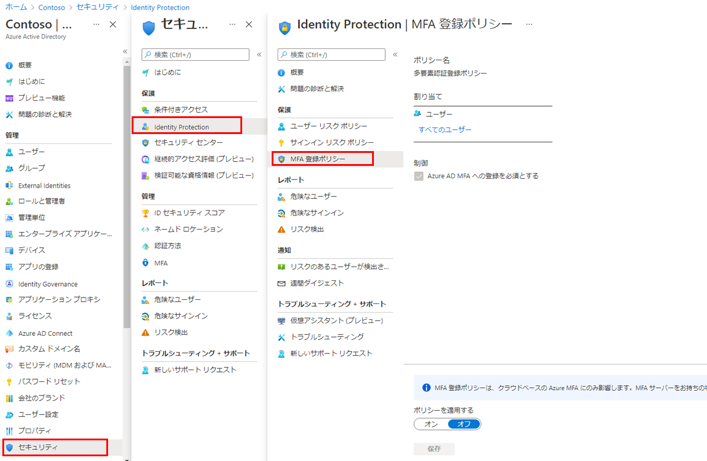

---
lab:
    title: '19 - Azure AD Multi-Factor Authentication 登録ポリシーを構成する'
    learning path: '02'
    module: 'モジュール 04 - Azure AD Identity Protection を管理する'
---

# ラボ 19 - Azure AD Multi-Factor Authentication 登録ポリシーを構成する

## ラボ シナリオ

Azure AD Multi-Factor Authentication は、ユーザー名とパスワードに加えて、その他の要素を使用することでユーザーを確認する手段を提供します。ユーザーのサインインに第 2 のセキュリティ層を提供します。ユーザーが MFA プロンプトに応答できるようにするには、まず Azure AD Multi-Factor Authentication に登録する必要があります。Azure AD 組織の MFA 登録ポリシーがすべてのユーザーに割り当てられるように構成する必要があります。

#### 推定時間: 5 分

## ポリシーの構成

1. グローバル管理者アカウントを使用して、[https://portal.azure.com]( https://portal.azure.com) にサインインします。

1. ポータル メニューを開き、**「Azure Active Directory」** を選択します。

1. 「Azure Active Directory」 ブレードで、**「管理」** の下にある **「セキュリティ」** を選択します。

1. 「セキュリティ」ブレードの左側のナビゲーションで **「ID 保護」** を選択します。

1. 「ID 保護」ブレードの左側のナビゲーションで、**「MFA 登録ポリシー」** を選択します。

    

1. **「割り当て」**

1. **「割り当て」** で、**「すべてのユーザー」** を選択し、使用可能なオプションを確認します。

1. **「すべてのユーザー」** を選択するか、ロールアウトを制限する場合は **「個人とグループの選択」** を選択します。

1. また、ポリシーからユーザーを除外することもできます。

1. **「コントロール」** で、**「Require Azure AD MFA registration」** (Azure AD MFA の登録が必要) が選択されていて、変更できないことに注意してください。

1. **「ポリシーを適用する」** で、**「オン」** を選択してから **「保存」** を選択します。
