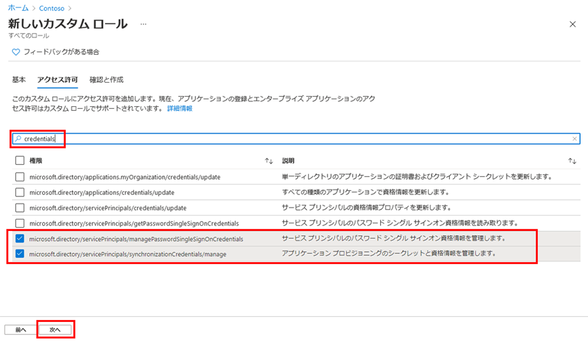

---
lab:
    title: '21 - 新しいカスタム ロールを作成してアプリ登録を管理するためのアクセス権を付与する'
    learning path: '03'
    module: 'モジュール 01 - SSO 用エンタープライズ アプリの統合の計画と設計を行う'
---

# ラボ 21 - 新しいカスタム ロールを作成してアプリ登録を管理するためのアクセス権を付与する

## ラボ シナリオ

アプリ管理用の新しいカスタム ロールを作成する必要があります。この新しいロールは、資格情報管理の実行に必要な特定の権限のみに限定する必要があります。

#### 推定時間: 5 分

## 新しいカスタム ロールを作成してアプリ登録を管理するためのアクセス権を付与する

1. グローバル管理者アカウントを使用して、[https://portal.azure.com](https://portal.azure.com) にサインインします。

1. ポータル メニューを開き、**「Azure Active Directory」** を選択します。

1. 「Azure Active Directory」 ブレードの **「管理」** で **「ロールと管理者」** を選択します。

1. 「ロールと管理者」ブレードで、メニューから **「新しいカスタム ロール」** を選択します。

    

1. 「新しいカスタム ロール」ブレードの「基本」タブで「名前」ボックスに **「マイ カスタム アプリ ロール」** と入力します。

1. 残りのオプションを確認してから、**「次へ」** を選択します。

1. 「アクセス許可」タブで、使用可能なアクセス許可を確認します。

1. **「Search by permission name or description」** (アクセス許可の名前または説明で検索) ボックスに**資格情報**を入力します。

1. 結果から **「管理」** アクセス許可を選択し、**「次へ」** を選択します。

    

1. 変更内容を確認し、**「作成」** を選択します。
