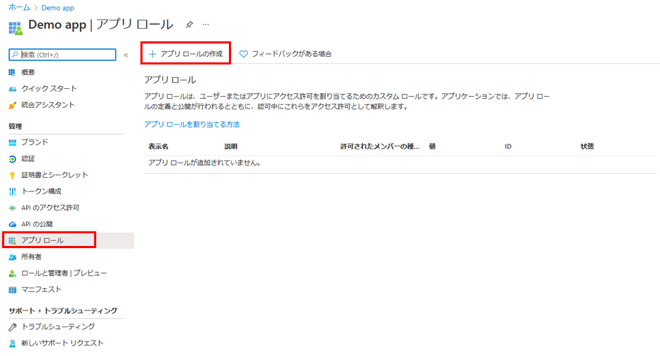

---
lab:
    title: '24 - アプリにアプリ ロールを追加してトークンで受け取る'
    learning path: '03'
    module: 'モジュール 03 - アプリの登録を実装する'
---

# ラボ 24: アプリにアプリ ロールを追加してトークンで受け取る

## ラボ シナリオ

ロールベースのアクセス制御 (RBAC) は、アプリケーションにおいて承認を実施する一般的なメカニズムです。RBAC を使用するとき、管理者は、個々のユーザーまたはグループではなく、ロールにアクセス許可を付与します。その後、管理者はロールをさまざまなユーザーやグループに割り当てて、コンテンツや機能にだれがアクセスできるかを制御できます。あなたは、RBAC ロールの実装を計画しており、手順の実行方法を理解していることを確認する必要があります。

#### 推定時間: 10 分

## アプリ ロール UI を使用してアプリ ロールを宣言する

>[!重要]
>アプリ ロールのポータル UI 機能はパブリック プレビュー段階です。このプレビュー版はサービス レベル アグリーメントなしで提供されています。運用環境のワークロードに使用することはお勧めできません。特定の機能はサポート対象ではないか、機能が制限されることがあります。

Azure portal のユーザー インターフェイスを使用してアプリ ロールを作成するには、次のようにします。

1. グローバル管理者アカウントを使用して、[https://portal.azure.com](https://portal.azure.com) にサインインします。

1. ポータル メニューを開き、**「Azure Active Directory」** を選択します。

1. **「Azure Active Directory」** ブレードの **「管理」** の下にある **「アプリの登録」** を選択します。

1. **「アプリ ロール」 | 「プレビュー」** を選択し、**「アプリ ロールの作成」** を選択します。

    

1. **「アプリ ロールの作成」** ウィンドウの **「表示名」** ボックスに **「アンケート ライター」** と入力します。

1. **「Allow member types」** (メンバーの種類を許可) で、**「ユーザー/グループ」** を選択します。

1. **「値」** ボックスに **「Survey.Create」** と入力します。

1. **「説明」** ボックスに、**「ライターはアンケートを作成できます」** と入力します。

1. 説明は必須のフィールドであることに注意してください。

1. **「Do you want to enable this app role」** (このアプリ ロールを有効にしますか) が選択されていることを確認してから、**「適用」** を選択します。

## ロールにユーザーとグループを割り当てる

アプリケーションにアプリ ロールを追加したら、それらのロールにユーザーとグループを割り当てることができます。ポータルの UI から、または [https://docs.microsoft.com/graph/api/user-post-approleassignments](https://docs.microsoft.com/graph/api/user-post-approleassignments) を使用してプログラミングによって、ユーザーとグループをロールに割り当てます。さまざまなアプリのロールに割り当てられたユーザーがアプリケーションにサインインすると、roles 要求で割り当てられたロールがトークンに付与されます。

Azure portal を使用してロールにユーザーとグループを割り当てるには、次のようにします。

1. [https:portal.azure.com](https:portal.azure.com) にサインインします。

1. Azure Active Directory の左側にあるナビゲーション メニューで、**「エンタープライズ アプリケーション」** を選択します。

1. **「すべてのアプリケーション」** リストで **「デモ アプリ」** を選択します。

1. このアプリは、前の演習で作成されました。

1. **「管理」** で **「ユーザーとグループ」** を選択します。

1. メニューで、**「+ ユーザーまたはグループの追加」** をクリックします。

1. **「割り当ての追加」** ブレードで **「ユーザーとグループ」** を選択します。

1. ユーザーとセキュリティ グループの一覧が表示されます。特定のユーザーまたはグループを検索したり、一覧に表示される複数のユーザーやグループを選択したりできます。

1. ユーザーとグループを選択したら、**「選択」** を選択します。

1. **「ロールの選択」** 割り当てを使用すると、アプリケーションに定義されているロールがすべて表示されます。

1. ロールを選択し、**「選択」** を選択します。

1. **「割り当て」** を選択して、アプリへのユーザーとグループの割り当てを終了します。

1. 追加したユーザーとグループが **「ユーザーとグループ」** のリストに表示されることを確認します。
