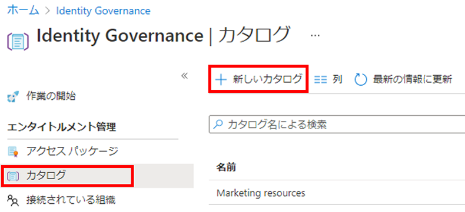
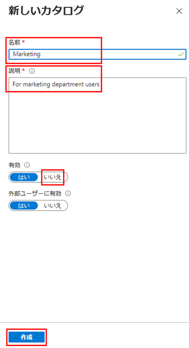
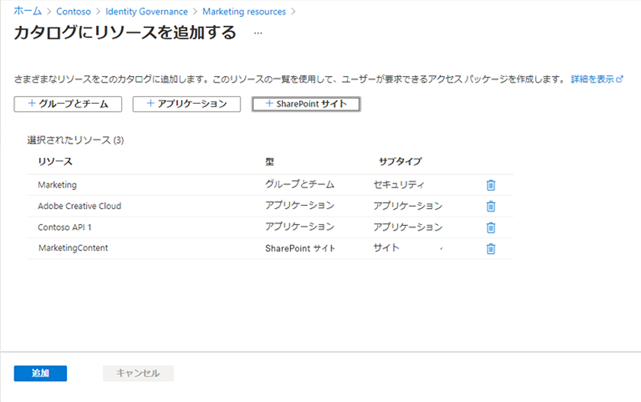
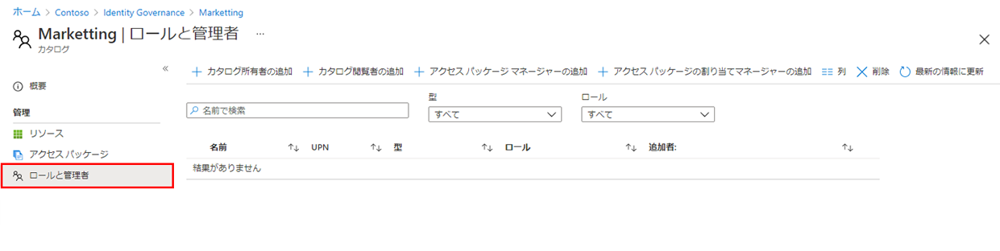
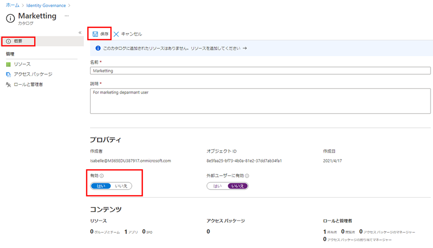

---
lab:
    title: '25 - Azure AD エンタイトルメント管理でリソースのカタログを作成して管理する'
    learning path: '04'
    module: 'モジュール 01 - エンタイトルメント管理の計画と実装を行う'
---

# ラボ 25: Azure AD エンタイトルメント管理でリソースのカタログを作成して管理する

## ラボ シナリオ

カタログは、リソースとアクセス パッケージのコンテナーです。関連するリソースとアクセス パッケージをグループ化するときは、カタログを作成します。どのユーザーでも、カタログを作成すると、最初のカタログ所有者になります。カタログ所有者は、別のカタログ所有者を追加できます。組織では、カタログを作成して構成する必要があります。

#### 推定時間: 15 分

## カタログを作成する

1. グローバル管理者アカウントを使用して、[https://portal.azure.com](https://portal.azure.com) にサインインします。

    >重要
    >Azure AD Terms of Use を使用および構成するには、以下が必要です。
    >
    >- Azure AD Premium P1、P2、EMS E3、EMS E5 のいずれかのサブスクリプション。
    >- これらのサブスクリプションをお持ちでない場合は、Azure AD Premium を入手するか、Azure AD Premium 試用版を有効にすることができます。
    >- 構成するディレクトリに対する次のいずれかの管理者アカウント。
    >    - グローバル管理者
    >    - セキュリティ管理者
    >    - 条件付きアクセス管理者

1. **「Azure Active Directory」** を開き、**「Identity Governance」** を選択します。

1. 左側のメニューの **「エンタイトルメント管理」** で、**「カタログ」** を選択します。

1. 上部のメニューで **「+ 新しいカタログ」** を選択します。

    

1. 「新しいカタログ」ウィンドウで、**「名前」** ボックスに **「Marketing」** と入力します。

1. **「説明」** ボックスに **「マーケティング部門ユーザー」** と入力します。この情報は、アクセス パッケージの詳細に表示されます。

1. **「Enabled for external users」** (外部ユーザーに対して有効) を指定すると、選択した外部ディレクトリのユーザーが、このカタログのアクセス パッケージを要求できるようになります。この設定は変更されません。

1. **「有効」で「いいえ」** を選択します。

1. カタログをステージするか、必要になるまで無効にしておくかにより、カタログの即時使用を有効または無効にできます。この演習では、カタログを有効にする必要はありません。

    

1. 「作成」を選択します。

## カタログにリソースを追加する

アクセス パッケージにリソースを含めるには、リソースがカタログ内に存在している必要があります。追加できるリソースの種類は、グループ、アプリケーション、および SharePoint Online サイトです。追加できるグループは、クラウドで作成された Microsoft 365 グループ、またはクラウドで作成された Azure AD セキュリティ グループです。追加できるアプリケーションは Azure AD エンタープライズ アプリケーションで、これには SaaS アプリケーションと、Azure AD にフェデレーションされた独自アプリケーションの両方が含まれます。追加できるサイトは、SharePoint Online サイトまたは SharePoint Online サイト コレクションです。

1. 「Identity Governance」 ブレードで、必要に応じて **「カタログ」** を選択します。

1. **「カタログ」** の一覧で **「Marketing」** を選択します。

1. 左側のナビゲーション メニューの **「管理」** で、**「リソース」** を選択します。

1. メニューで、**「+ リソースの追加」** を選択します。

1. 「Add resources to catalog」 (カタログへのリソースの追加) ブレードで、使用可能なオプションを確認します。

1. 「Groups and Teams」 (グループとチーム)、「アプリケーション」、または 「SharePoint サイト」にはリソースがないかもしれません。任意のリソース カテゴリを選択し、そのカテゴリからリソースを選択します。

1. この演習では、使用可能などのリソースを選択してもかまいません。

    

1. 終了したら、**「追加」** をクリックします。これらのリソースをカタログ内のアクセス パッケージに含めることができるようになりました。

## カタログ所有者をさらに追加する

カタログを作成したユーザーは最初のカタログ所有者になります。カタログの管理を委任するには、カタログ所有者ロールにユーザーを追加します。これは、カタログの管理責任を共有するのに役立ちます。

1. 「Marketing カタログ」ブレードの左側のナビゲーション メニューで、「ロールと管理者」を選択します。

1. 必要に応じて、Azure portal で **「Azure Active Directory」** > **「Identity Governance」 > 「カタログ」** に移動し、**「Marketing」** を選択します。

    

1. 上部のメニューで、利用可能なロールを確認し、**「+ 所有者の追加」** を選択します。

1. 「メンバーの選択」ウィンドウで管理者アカウントを選択し、**「選択」** を選択します。

1. 「ロールと管理者」の一覧で、新しく追加したロールを確認します。

## カタログを編集する

カタログの名前と説明を編集できます。この情報は、アクセス パッケージの詳細に表示されます。

1. 「Marketing」 ブレードの左側のナビゲーションで、**「概要」** を選択します。

1. 上部のメニューで、**「編集」** を選択します。

1. 設定を確認し、**「プロパティ」** > **「有効」** で **「はい」** を選択します。

    

1. **「保存」** を選択します。

## カタログを削除する

カタログを削除できるのは、そのカタログにどのアクセス パッケージも含まれていない場合に限られます。

1. Marketing カタログの「概要」ページで、上部のメニューの「削除」を選択します。

1. 「削除」ダイアログ ボックスで情報を確認し、**「はい」** を選択します。
