---
lab:
    title: '26 - 利用規約と同意レポートを追加する'
    learning path: '04'
    module: 'モジュール 01 - エンタイトルメント管理の計画と実装を行う'
---

# ラボ 26: 利用規約と同意レポートを追加する 

## ラボ シナリオ

Azure AD 利用規約ポリシーは、エンド ユーザーに情報を提示するために使うことができる簡単な方法を提供します。この方法で情報を提示することにより、法律上やコンプライアンス上の要件を満たすうえで重要な免責事項が確実にユーザーに表示されます。この記事では、利用規約 (ToU) ポリシーの使用を開始する方法について説明します。

ToU ポリシーを作成して組織に適用する必要があります。

#### 推定時間: 20 分

## 利用規約の追加

利用規約のドキュメントが完成した後は、次の手順を使って追加します。

1. グローバル管理者アカウントを使用して、[https://portal.azure.com](https://portal.azure.com) にサインインします。

1. **「Azure Active Directory」** を開き、**「Identity Governance」** を選択します。

1. 左側のナビゲーション メニューの **「利用規約」** で、**「利用規約」** を選択します。

1. 「利用規約」ページの上部のメニューで、**「+ New terms」** (+ 新規の利用規約) を選択します

    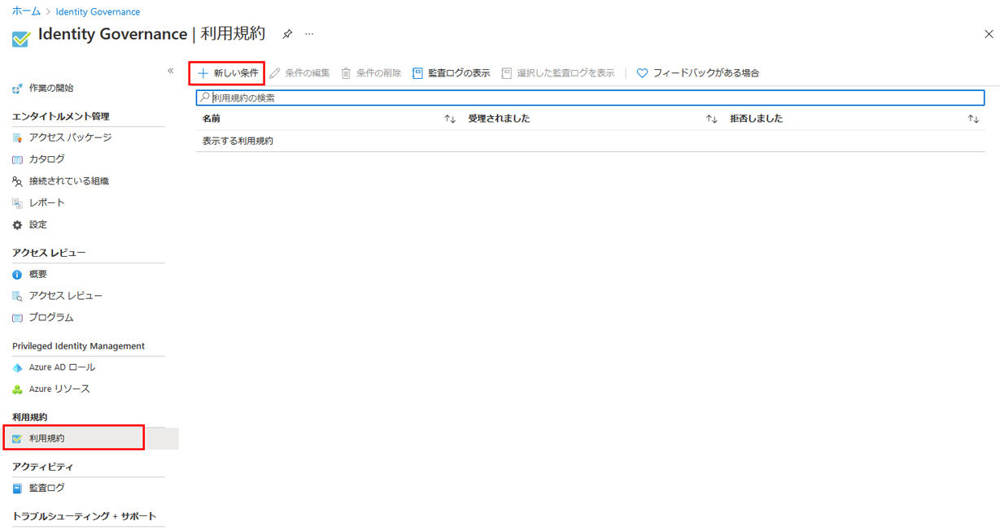

1. **「名前」** ボックスに **「利用規約のテスト」** と入力します。

1. これは、Azure portal で使用される利用規約です。

1. **「表示名」** ボックスに、**「Contoso 利用規約」** と入力します。

1. これは、ユーザーがサインインするときに表示されるタイトルです。

1. **「利用規約のドキュメント ボックス」** を選択し、完成した利用規約の PDF を参照して選択します。

1. この演習では、手元にある任意の PDF を選択しても、Microsoft Word を使用して利用規約ドキュメントを作成し、PDF に出力してもかまいません。

1. 利用規約のドキュメントの言語を選択します。

1. 言語オプションを使用して、言語が異なる複数の利用規約をアップロードできます。エンドユーザーに表示される利用規約のバージョンは、ブラウザーの設定に基づきます。

1. エンド ユーザーが同意する前に利用規約を表示しなければならないようにする場合、**「ユーザーは利用規約を展開する必要があります」** を **「オン」** に設定します。

1. エンド ユーザーがアクセスするすべてのデバイスで利用規約に同意しなければならないようにする場合、**「各デバイスでユーザーによる同意が必要」** を **「オン」** にします。このオプションが有効な場合、追加のアプリケーションのインストールがユーザーに要求される可能性があります。

    >[!警告]  
    >各デバイスでの同意が指定されていると、ユーザーは、アクセス権を取得する前に、各デバイスを Azure AD に登録する必要があります。

1. 定期的に利用規約への同意を期限切れにする場合、**「同意の期限」** を **「オン」** にします。オンに設定すると、2 つのスケジュール設定が追加表示されます。

    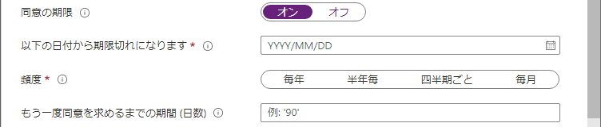

1. **「以下の日付から期限切れになります」** (期限切れの開始日) および **「頻度」** 設定を使用して、利用規約の有効期限のスケジュールを指定します。次の表に、いくつかの設定例とその結果を示します。

    | 期限切れの開始日 | 頻度 | 結果 |
    |---|---|---|
    | 今日の日付 | 月単位 | ユーザーは本日から利用規約に同意する必要があります。また、毎月再同意する必要があります。|
    | 未来の日付 | 月単位 | ユーザーは本日から利用規約に同意する必要があります。未来の日付が来ると、同意の有効期限が切れ、ユーザーは毎月再同意する必要があります。 |

    たとえば、期限切れの開始日を **1 月 1 日**に設定し、頻度で **「月単位」** を選んだ場合、2 人のユーザーの有効期限は次のようになります。

    | ユーザー | 最初の同意日 | 最初に有効期限が切れる日付 | 2 回目に有効期限が切れる日付 | 3 回目に有効期限が切れる日付 |
    |---|---|---|---|---|
    | Alice | 1 月 1 日 | 2 月 1 日 | 3 月 1 日 | 4 月 1 日|
    | Bob | 1 月 15 日 | 2 月 1 日 | 3 月 1 日| 4 月 1 日 |

1. **「もう一度同意を求めるまでの期間 (日数)」** 設定を使用して、ユーザーが利用規約に再同意する必要があるまでの日数を指定します。これにより、ユーザーに個別のスケジュールを適用することができます。たとえば、日数に **30** 日を指定すると、2 人のユーザーの有効期限は次のようになります。

    | ユーザー | 最初の同意日 | 最初に有効期限が切れる日付 | 2 回目に有効期限が切れる日付 | 3 回目に有効期限が切れる日付 |
    |---|---|---|---|---|
    | Alice | 1 月 1 日 | 1 月 31 日 | 3 月 2 日 | 4 月 1 日|
    | Bob | 1 月 15 日 | 2 月 14 日 | 3 月 16 日| 4 月 15 日

    >[!注]  
    >「期限切れの同意」と「再同意を要求するまでの日数」の両方の設定を使用することもできますが、通常はどちらか一方を使用します。

1. **「条件付きアクセス」** で **「カスタム ポリシー」** を選択します。

    | テンプレート | 説明 |
    |---|---|
    | **クラウド アプリへのアクセス (すべてのゲスト用)** | すべてのゲストとすべてのクラウド アプリに対して条件付きアクセス ポリシーが作成されます。このポリシーは、Azure portal に影響します。これが作成された後、サインアウトしてサインインし直さなければならないことがあります。 | 
    |**クラウド アプリへのアクセス (すべてのユーザー用)** | すべてのユーザーとすべてのクラウド アプリに対して条件付きアクセス ポリシーが作成されます。このポリシーは、Azure portal に影響します。これが作成された後、サインアウトしてサインインし直す必要があります。 |
    | **カスタム ポリシー** | この利用規約が適用されるユーザー、グループ、およびアプリを選択します。 |
    | **条件付きアクセス ポリシーを後で作成する** | この利用規約は、条件付きアクセス ポリシーを作成するときに、制御の許可一覧に表示されます。 |

    >[!重要]  
    >条件付きアクセス ポリシー規制 (利用規約を含む) は、サービス アカウントに対する強制をサポートしていません。サービス アカウントはすべて、条件付きアクセス ポリシーから除外することをお勧めします。

    カスタム条件付きアクセス ポリシーを使うと、特定のクラウド アプリケーションやユーザー グループまで、きめ細かい利用規約を有効にできます。詳細については、[https://docs.microsoft.com/ja-jp/azure/active-directory/conditional-access/require-tou](https://docs.microsoft.com/en-us/azure/active-directory/conditional-access/require-tou) を参照してください。

1. 完了したら、**「作成」** を選択します。

    

1. 利用規約が作成されると、「条件付きアクセス ポリシー」ページに自動的に移動します。そのページの **「名前」** ボックスに **「利用規約を適用」** と入力します。

1. **「割り当て」** で、**「ユーザーとグループ」** を選択します。

1. 「対象」タブで **「ユーザーとグループ」** チェック ボックスをオンにします。

1. 「選択」ウィンドウで、利用規約ポリシーのテストに使用するアカウントを選択します。

1. すべての条件付きアクセス ポリシーと同様に、管理者アカウントを選択する場合は、条件付きアクセス ポリシーを変更するための十分なアクセス許可を持つ別のアカウントがあることを確認してください。これは、条件付きアクセス ポリシーが望ましくない結果になった場合に、管理者アカウントがロックアウトされないようにするためです。

1. **「クラウド アプリまたは操作」** を選択します。

1. **「アプリを選択」** を選択し、**「Office 365」** を選択します。

1. **「アクセス制御」** で、**「許可」** を選択します。

1. 「許可」ウィンドウで、**「利用規約のテスト」** を選択し、**「選択」** を選択します。

1. **「ポリシーの有効化」** で、 **「オン」** を選択します。

1. 完了したら、**「作成」** を選択します。

    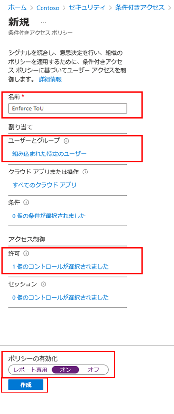

1. 自分のアカウントを使用することを選択した場合は、ブラウザーを最新の状態に更新できます。再度サインインするように求められます。サインインするときに、利用規約に同意する必要があります。

## 同意したユーザーと拒否したユーザーのレポートの表示

「利用規約」ブレードには、同意したユーザーと拒否したユーザーの数が表示されます。これらの数および同意したユーザーと拒否したユーザーは、利用規約が有効な間、保存されます。

1. Microsoft Azure の **「Identity Governance」 > 「利用規約」** で、自分の利用規約を見つけます。

1. 利用規約で、**「同意」** または **「拒否」** の下に表示される数値を選択し、現在のユーザーの状態を表示します。

    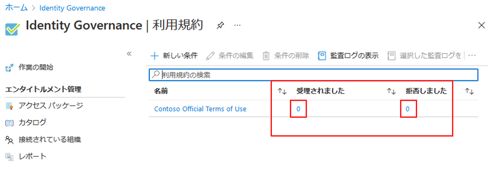

1. この演習では、同意または拒否された利用規約がない可能性があります。次の例では、**「同意」** の値が選択されています。利用規約に同意したユーザーのユーザー情報のレポートを見ることができます。

    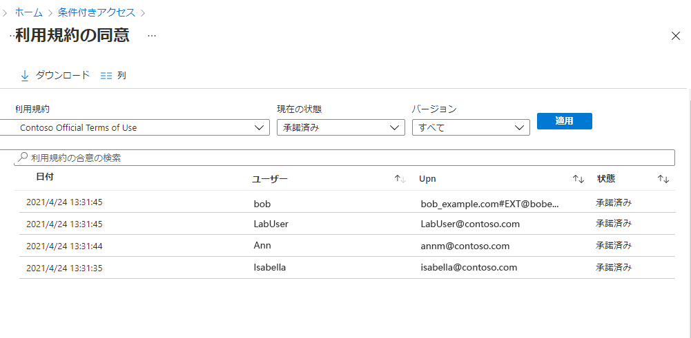

1. 個々のユーザーの履歴を表示するには、ユーザー名の右側にある省略記号を選択して、**「履歴の表示」** を選択します。

    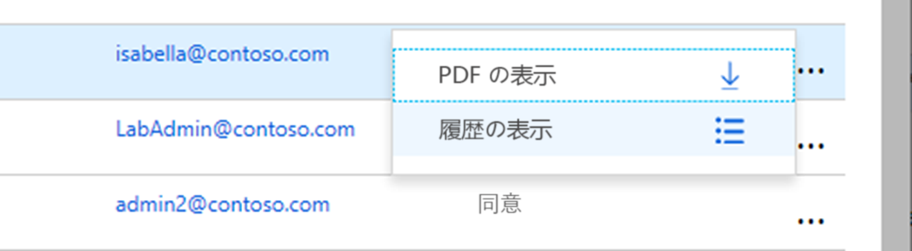

1. 履歴の表示ウィンドウでは、すべての同意、拒否、および有効期限切れの履歴を確認できます。

    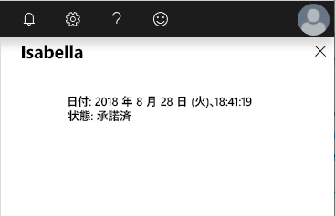

## ユーザーに表示される利用規約の外観

1. 利用規約を作成して適用すると、スコープ内のユーザーに利用規約のページが表示されるようになります。

    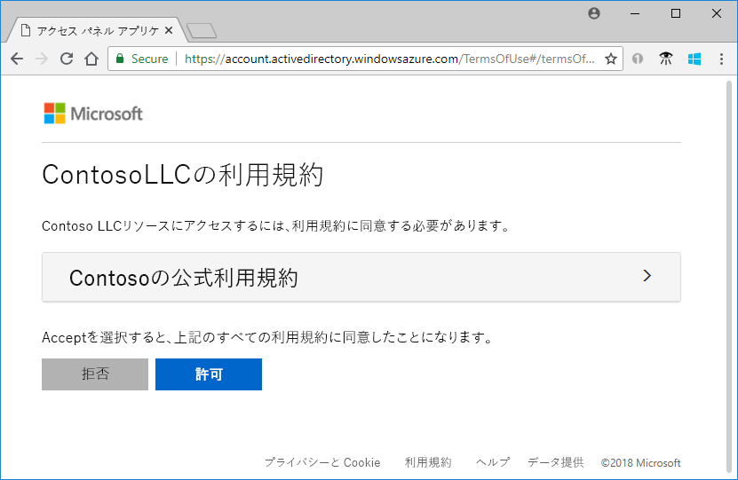

1. ユーザーは利用規約を表示し、必要な場合はボタンを使用して拡大/縮小できます。

    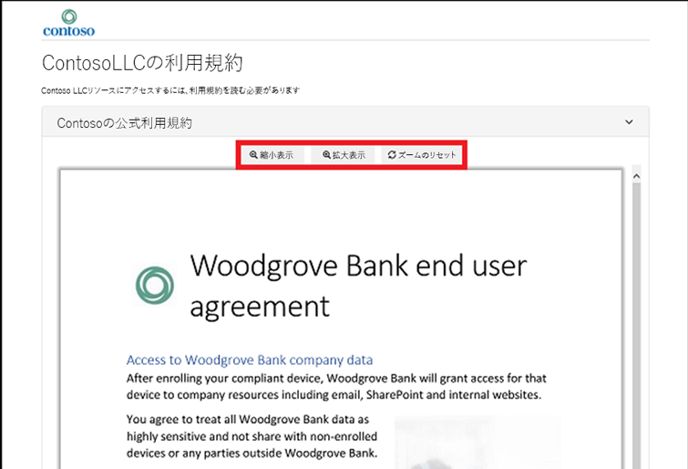

1. モバイル デバイスでは、次の例のような利用規約が表示されます。

    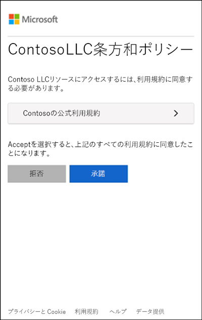

### ユーザーが利用規約を確認する方法

ユーザーは、以下の手順を使用して、同意した利用規約を確認できます。

1. [https://myapps.microsoft.com](https://myapps.microsoft.com/) を参照し、自分のユーザー アカウントを使用してサインインします。

1. 「概要」ページで、「VIEW SETTINGS AND PRIVACY」 (設定とプライバシーの表示) を選択します。

    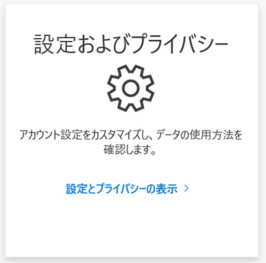

1. 「設定とプライバシー」ページで **「プライバシー」** タブを選択します。

    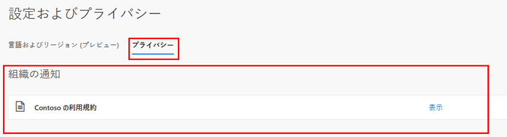

1. **「Organization’s notice」** (組織からの注意) で、同意した利用規約を確認できます。

## 利用規約の詳細を編集する

利用規約の詳細の一部を編集できますが、既存のドキュメントを変更することはできません。詳細の編集方法を次の手順で説明します。

1. [https://portal.azure.com](https://portal.azure.com) にグローバル管理者としてサインインします。

1. 「Azure Active Directory」 を開き、**「Identity Governance」** を選択します。

1. 左側のナビゲーション メニューの **「利用規約」** で、**「利用規約」** を選択します。

1. 編集する利用規約を選択します。

1. 上部メニューで **「Edit terms」** (利用規約の編集) を選択します。

1. 「Edit terms」 ウィンドウでは、次を変更できます。

    - **名前** – これは、エンドユーザーとは共有されない利用規約の内部名です。
  
    - **表示名** – これは、エンドユーザーが利用規約を閲覧する際に表示される名前です。

    - **Require users to expand the terms of use (ユーザーに利用規約の展開を要求する)** – これを **「オン」** に設定すると、エンドユーザーが利用規約のドキュメントを承認する前に、その文書を展開するように強制されます。

    - **既存の利用規約ドキュメントを更新**します。

    - 既存の利用規約に言語を追加できます。各デバイスでユーザーによる同意が必要、期限切れの同意、再同意までの日数、条件付きアクセス ポリシーなど、その他の設定も変更したい場合は、新しい利用規約を作成する必要があります。

    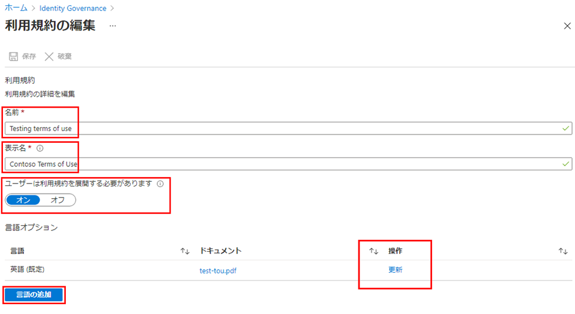

1. 完了したら、**「保存」** を選択して変更を保存します。

## 既存の利用規約ドキュメントを更新する

場合によっては、利用規約ドキュメントの更新が必要になることがあります。

1. 編集する利用規約を選択します。

1. **「Edit terms」** (利用規約の編集) を選択します。

1. **「言語オプション」** のテーブルで、更新する利用規約の言語を確認し、**「操作」** 列の **「更新」** を選択します。

    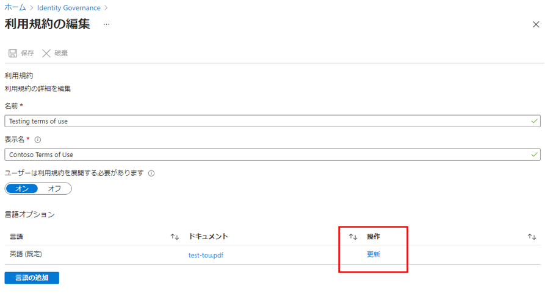

1. 「Update terms of use version」 (利用規約のバージョンの更新) ウィンドウでは、利用規約ドキュメントの新しいバージョンをアップロードできます。

1. さらに、次回のサインイン時にこの新しいバージョンに同意するようにユーザーに要求したい場合は、**「Require reaccept」** (再同意を要求) トグル ボタンを使用できます。ユーザーに再同意を要求しない場合、ユーザーの以前の同意は最新の状態に保たれ、以前に同意していない、または同意が失効した新規ユーザーにのみ新しいバージョンが表示されます。

    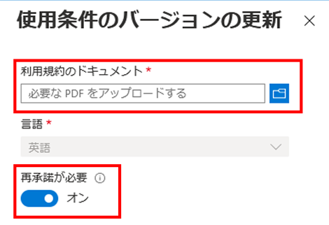

1. 新しい PDF をアップロードして再同意を決定したら、**「追加」** を選択します。

1. これで、「ドキュメント」列に最新バージョンが表示されます。
