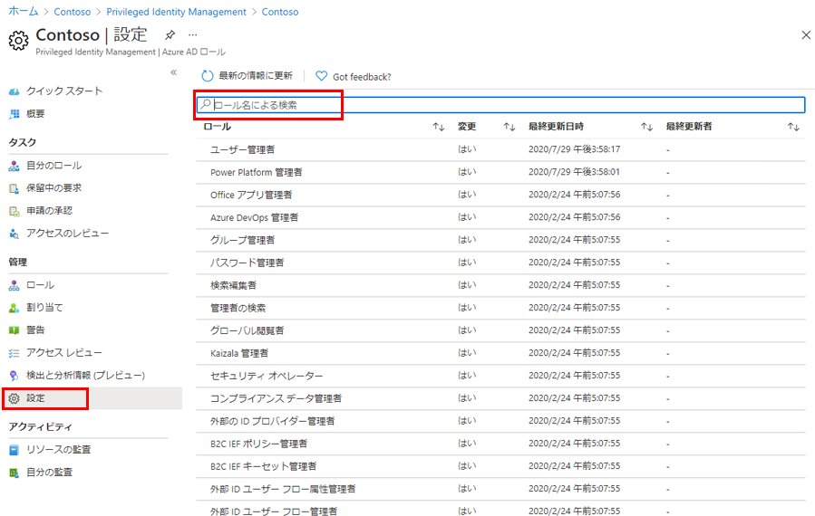
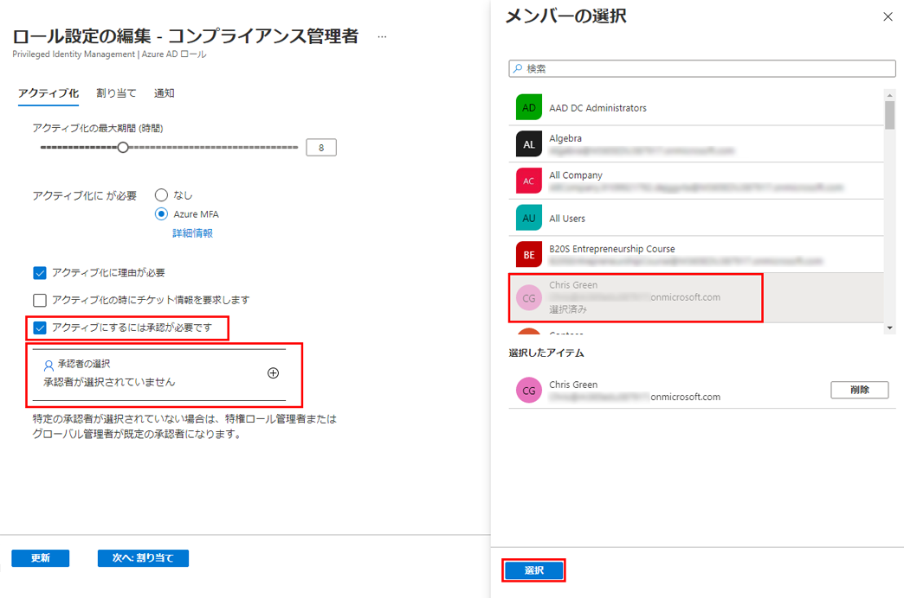

---
lab:
    title: '28 - Azure AD ロール用に Privileged Identity Management を構成する'
    learning path: '04'
    module: 'モジュール 03 - 特権アクセスの計画と実装を行う'
---

# ラボ 28: Azure AD ロール用に Privileged Identity Management を構成する

## ラボ シナリオ

特権ロール管理者は、ロール候補の割り当てをアクティブ化しているユーザーの操作性を変更するなど、Azure Active Directory (Azure AD) 組織の Privileged Identity Management (PIM) をカスタマイズできます。PIM の構成について理解する必要があります。

#### 推定時間: 15 分

## Azure AD ロールの設定を構成する

### ロールの設定を開く

次の手順を実行して、Azure AD ロールの設定を開きます。

1. [https://portal.azure.com](https://portal.azure.com) にグローバル管理者としてサインインします。

1. **「Azure AD Privileged Identity Management」** を検索してから選択します。

1. Privileged Identity Management ブレードの左側のナビゲーションで **「Azure AD ロール」** を選択します。

1. クイック スタート ページの左側のナビゲーションで **「設定」** を選択します。

    

1. ロールの一覧を確認してから、**「ロール名で検索」** に **「コンプライアンス」** と入力します。

1. 結果から **「コンプライアンス管理者」** を選択します。

1. ロール設定の詳細情報を確認します。

### アクティブ化の承認を必須にする

複数の承認者を設定すると、承認者の 1 人が承認または拒否するとすぐに承認プロセスが完了します。2 人以上のユーザーからの承認を要求することはできません。ロールをアクティブ化するために承認を必須にする場合は、次の手順を実行します。

1. ロール設定の詳細ページの上部のメニューで **「編集」** を選択します。

    

1. ロール設定の編集 - コンプライアンス管理者ブレードで **「アクティブ化には承認が必要です」** チェック ボックスをオンにします。

1. **「承認者の選択」** を選択します。

1. 「メンバーの選択」ウィンドウで管理者アカウントを選択し、**「選択」** を選択します。

    

1. ロール設定を構成したら、**「更新」** を選択して変更を保存します。
