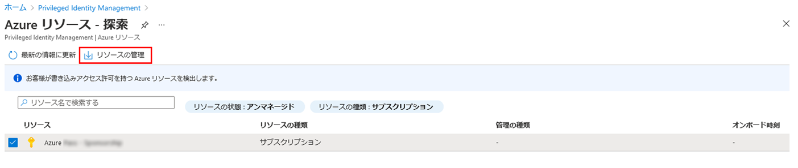
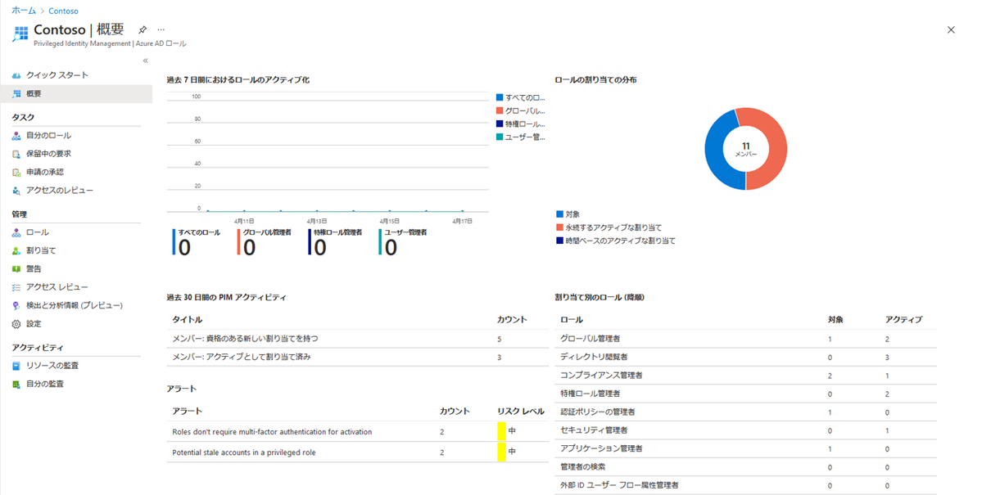

---
lab:
    title: '30 - Privileged Identity Management で Azure リソース ロールを割り当てる'
    learning path: '04'
    module: 'モジュール 03 - 特権アクセスの計画と実装を行う'
---

# ラボ 30: Privileged Identity Management で Azure リソース ロールを割り当てる

## ラボ シナリオ

Azure Active Directory (Azure AD) Privileged Identity Management (PIM) では、組み込みの Azure リソース ロールと、以下を含むカスタム ロール (ただしこれらに限定されません) を管理できます。

- 所有者

- ユーザー アクセス管理者

- 共同作成者

- セキュリティ管理者

- セキュリティ マネージャー

ユーザーを Azure リソース ロールの候補にする必要があります。

#### 推定時間: 10 分

## Azure リソース ロールを割り当てる

1. グローバル管理者アカウントを使用して、[https://portal.azure.com](https://portal.azure.com) にサインインします。

1. **「Azure AD Privileged Identity Management」** を検索してから選択します。

1. 「Privileged Identity Management」 ブレードの左側のナビゲーションで **「Azure リソース」** を選択します。

1. 上部のメニューで **「Discover resources」** (リソースの検出) を選択します。

1. 「Azure リソース - 検出」ブレードでサブスクリプションを選択し、上部のメニューで **「リソースの管理」** を選択します。

    

1. **「Onboarding selected resource for management」** (管理用に選択したリソースのオンボード) ダイアログ ボックスで情報を確認し、**「OK」** を選択します。

1. オンボードが完了したら、「Azure リソース - 検出」ブレードを閉じます。

1. 「Azure リソース」ブレードで、追加したリソースを選択します。

    

1. 左側のナビゲーション メニューで、**「管理」** の下にある **「ロール」** を選択して、Azure リソースのロールの一覧を表示します。

1. 上部のメニューで **「+ 割り当ての追加」** を選択します。

1. 「割り当ての追加」ブレードで、**「ロールの選択」** メニューを選択し、**「API Management サービス共同作成者」** を選択します。

1. **「メンバーの選択」** で **「メンバーが選択されていません」** を選択します。

1. 「メンバーまたはグループの選択」ウィンドウで、ロールを割り当てる組織のアカウントを選択します。

1. **「次へ」** をクリックします。

1. **「設定」** タブの **「割り当ての種類」** で、**「対象」** を選択します。

    - **「対象」** 割り当ては、ロールを使用するためのアクションを実行することをロールのメンバーに要求します。要求されるアクションには、多要素認証 (MFA) チェックの実行、業務上の妥当性の指定、指定された承認者に対する承認要求などがあります。

    - **アクティブ** 割り当ては、ロールを使用するために何らかのアクションを実行することをメンバーに要求しません。アクティブとして割り当てられたメンバーには常に、そのロールに割り当てられた特権があります。

1. 開始日時と終了日時を変更して割り当て期間を指定します。

1. 完了したら、**「割り当て」** を選択します。

1. 新しいロールの割り当てが作成されると、状態の通知が表示されます。

## 既存のリソースのロールの割り当てを更新または削除する

既存のロールの割り当てを更新または削除するには、次の手順を実行します。

1. **Azure AD Privileged Identity Management** を開きます。

1. **Azure リソース** を選択します。

1. 管理するリソースを選択して、その概要ページを開きます。

1. **「管理」** で、**「ユーザー」** を選択します。

1. **「資格のあるロール」** タブの「操作」列で、使用可能なオプションを確認します。

1. **「削除」** を選択します。

1. **「削除」** ダイアログ ボックスで情報を確認し、**「はい」** を選択します。
