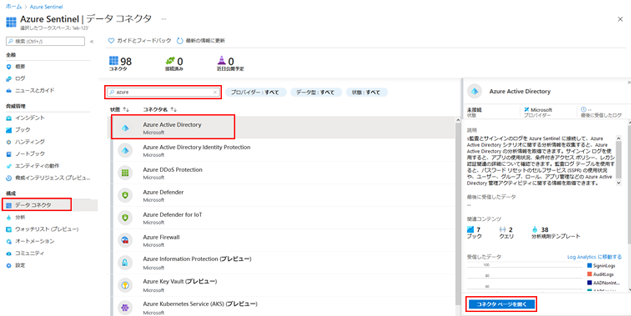
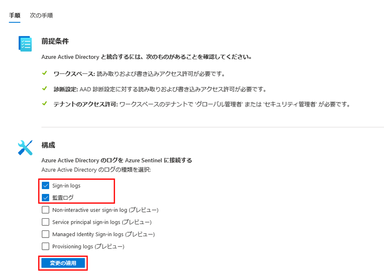

---
lab:
    title: '31 - Azure Active Directory (Azure AD) から Azure Sentinel へデータを接続する'
    learning path: '04'
    module: 'モジュール 04 - Azure Active Directory の監視と保守を行う'
---

# ラボ 31: Azure Active Directory (Azure AD) から Azure Sentinel へデータを接続する

## ラボ シナリオ

あなたの会社では、セキュリティ情報イベント管理 (SIEM) ソリューションの使用を開始する予定です。Azure Sentinel にアクセスできることはわかっているので、それを Azure AD に接続することに慣れる必要があります。

#### 推定時間: 10 分

## 前提条件

- 任意の Azure AD ライセンス (Free、O365、P1、P2) があれば、Azure Sentinel にサインイン ログを取り込むことができます。Azure Monitor (Log Analytics) と Azure Sentinel には、追加のギガバイト単位の料金が適用される場合があります。

- ユーザーには、ワークスペースの Azure Sentinel 共同作成者ロールを割り当てる必要があります。

- ユーザーには、ログをストリーミングするテナントの全体管理者またはセキュリティ管理者のロールを割り当てる必要があります。

- 接続の状態を確認できるように、ユーザーは Azure AD 診断設定に対する読み取りおよび書き込みアクセス許可を持っている必要があります。

## Azure Sentinel ワークスペースを作成および追加する

Azure Sentinel で使用できるワークスペースがまだない場合は、これらの手順を使用します。

1. グローバル管理者アカウントを使用して、[https://portal.azure.com](https://portal.azure.com) にサインインします。

1. **「Azure Sentinel」** を検索して選択します。

1. 「Azure Sentinel ワークスペース」ブレードのメニューで、**「+ 追加」** を選択します。

1. Azure Sentinel ワークスペースが既にある場合は、それを選択して次のタスクに進むことができます。

1. 「ワークスペースへの Azure Sentinel の追加」ブレードで、**「新しいワークスペースの作成」** を選択します。

1. 次の情報を使用して、新しい Log Analytics ワークスペースを作成します。

    | 設定| 値|
    | :--- | :--- |
    | サブスクリプション| 現在のサブスクリプションを使用します。|
    | リソース グループ| 既存のリソース グループを使用するか、新しいリソース グループを作成します。|
    | 名前| **Lab-workspace-yourinitialsanddate** ワークスペースはグローバルに一意の値である必要があります。|
    | 価格レベル| 従量課金制|

1. 完了したら、新しいワークスペースを選び、**「追加」** を選択して Azure Sentinel にワークスペースを追加します。

## Azure Active Directory に接続する

Azure Sentinel の組み込みコネクタを使用して、[https://docs.microsoft.com/ja-jp/azure/active-directory/fundamentals/active-directory-whatis](https://docs.microsoft.com/en-us/azure/active-directory/fundamentals/active-directory-whatis) からデータを収集し、それを Azure Sentinel にストリーミングできます。コネクタを使用すると、[https://docs.microsoft.com/ja-jp/azure/active-directory/reports-monitoring/concept-sign-ins](https://docs.microsoft.com/en-us/azure/active-directory/reports-monitoring/concept-sign-ins) と [https://docs.microsoft.com/ja-jp/azure/active-directory/reports-monitoring/concept-audit-logs](https://docs.microsoft.com/en-us/azure/active-directory/reports-monitoring/concept-audit-logs) からストリーミングできます。

1. Azure Sentinel で、左側のナビゲーション メニューの **「構成」** の下にある **「データ コネクタ」** を選択します。

1. **「データ コネクタ」** リストで、**Azure Active Directory** を選んでから、**「Open connector page」** (コネクタ ページを開く) を選択します。

    

1. **「構成」** で、**「Azure Active Directory のサインイン ログ」** と **「監査ログ」** のチェック ボックスをオンにしてから、**「変更の適用」** を選択します。

    

1. Azure Active Directory コネクタ ページを閉じます。
